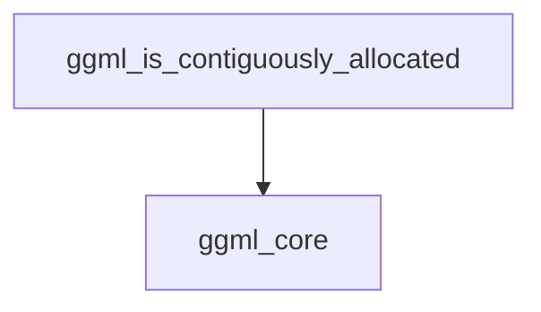

# Module: overall_allocation_checks

## Introduction:
The `overall_allocation_checks` module is a crucial part of the `ggml_tensor_properties` sub-system within the `ggml_core` library. It provides utilities for verifying the contiguous memory allocation of `ggml_tensor` objects, which is fundamental for efficient data processing and correct operation within the GGML framework.

## Purpose and Core Functionality:
This module's primary function is to determine if a given `ggml_tensor` object occupies a single, contiguous block of memory. Contiguous allocation is vital for performance in numerical computations, as it allows for optimized memory access patterns and can prevent issues related to data scattering.

The core functionality is encapsulated in the `ggml_is_contiguously_allocated` function. This function performs a direct check by comparing the total number of bytes a tensor is expected to occupy (based on its number of elements, type size, and block size) against the actual number of bytes it consumes. If these values match, the tensor is considered contiguously allocated.

## Architecture and Component Relationships:

The `overall_allocation_checks` module contains the following core component:

*   **`ggml_is_contiguously_allocated`**: This function (defined in `ggml.c`) verifies the contiguous memory allocation of a `ggml_tensor`. It relies on basic tensor properties such as total bytes, number of elements, type size, and block size, which are typically managed by the [ggml_core](ggml_core.md) module.

## How the module fits into the overall system:
The `overall_allocation_checks` module is an integral part of the GGML memory management and tensor property verification system. It provides a foundational check that other higher-level operations within [ggml_core](ggml_core.md) and related modules can leverage to ensure data integrity and optimal performance. For instance, backend implementations might use this check before performing operations that require contiguous memory, thereby preventing potential errors or performance bottlenecks. It contributes to the robustness and efficiency of tensor operations throughout the GGML ecosystem.

<!-- DIAGRAM_JSON
{
    "direction": "TD",
    "nodes": [
        {"id": "ggml_is_contiguously_allocated", "label": "ggml_is_contiguously_allocated", "type": "component", "link": null},
        {"id": "ggml_core", "label": "ggml_core", "type": "external", "link": "ggml_core.md"}
    ],
    "edges": [
        {"source": "ggml_is_contiguously_allocated", "target": "ggml_core"}
    ],
    "groups": []
}
-->
