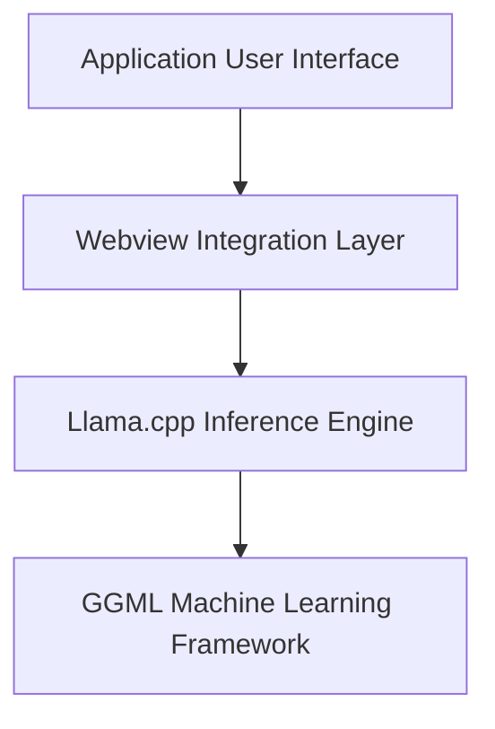

The `ollama-src` repository provides the source code for Ollama, a project designed to run large language models (LLMs) locally. It integrates a user-friendly webview-based interface with a robust C++/Go backend. The core functionality leverages the `llama.cpp` library for efficient LLM inference, which in turn relies on the `GGML` machine learning framework for low-level tensor operations, hardware acceleration (CPU, Metal, Vulkan), quantization, and multimodal capabilities (e.g., image and audio processing). The repository aims to offer a complete, optimized, and accessible solution for local LLM deployment.

