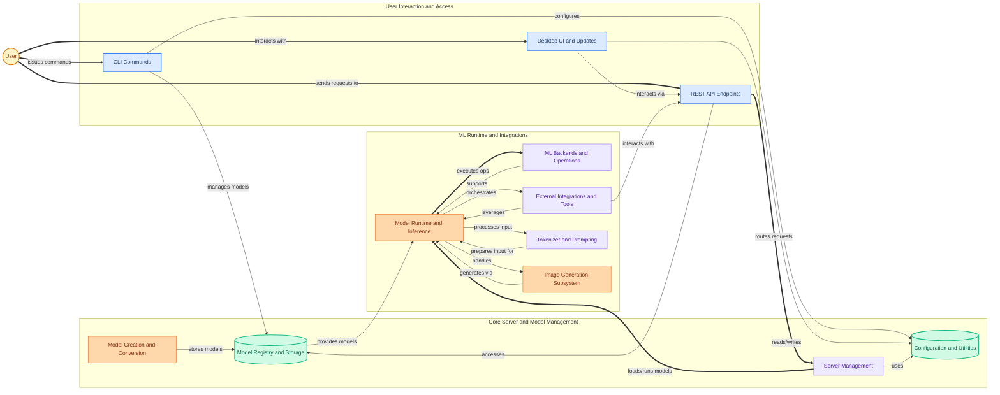

Ollama is an open-source platform designed to simplify the local deployment and management of large language models (LLMs) and other generative AI models. It provides a unified interface for users and developers to download, run, create, and interact with a wide range of models directly on their machines, abstracting away the complexities of ML infrastructure. Ollama aims to make powerful AI models accessible for local development, experimentation, and integration into various applications and workflows.

Users primarily interact with Ollama through:
1.  **Model Management**: Easily pull pre-trained models from a registry, create custom models, or delete existing ones via CLI or API.
2.  **Model Inference**: Run models for various tasks like chat, text generation, embeddings, and image generation, receiving responses through a local server.
3.  **Tool Integration**: Integrate Ollama with external tools and platforms (e.g., VS Code, Hermes) to leverage local models within their preferred environments.
4.  **Configuration & Monitoring**: Configure application settings, manage server lifecycle, and monitor model performance.

