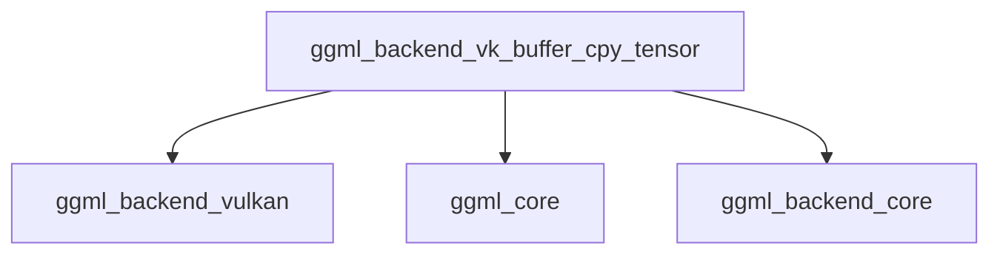
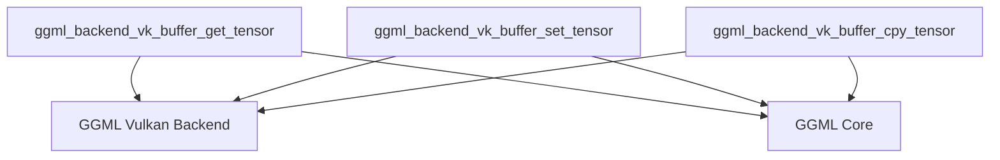
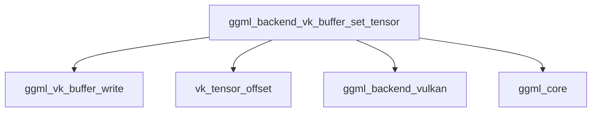

# part_1 Module Documentation
# Module: part_1

## Introduction

The `part_1` module, residing within the `vk_tensor_copy_operations` sub-module of `ggml_backend_vulkan`, provides the core functionality for copying tensor data directly between Vulkan device buffers. It encapsulates the low-level Vulkan API calls necessary to perform efficient memory transfers for `ggml_tensor` objects residing on Vulkan-enabled devices.

## Purpose and Core Functionality

The primary purpose of the `part_1` module is to enable efficient and direct copying of tensor data between two `ggml_tensor` objects that are backed by Vulkan buffers. This is a critical operation in many deep learning workloads, especially when data needs to be moved or duplicated within the GPU's memory space without involving CPU transfers. The module's core component, `ggml_backend_vk_buffer_cpy_tensor`, handles the specifics of identifying Vulkan buffers, calculating memory offsets, and invoking the underlying Vulkan buffer copy mechanisms.

### Core Component: `ggml_backend_vk_buffer_cpy_tensor`

This static function is responsible for orchestrating the tensor data copy. It performs the following key steps:

1.  **Buffer Type Verification**: It first verifies that the source tensor's backing buffer is indeed a Vulkan buffer using `ggml_backend_buffer_is_vk`.
2.  **Context Extraction**: It retrieves the Vulkan-specific buffer contexts (`ggml_backend_vk_buffer_context`) for both the source and destination tensors.
3.  **Buffer Handle Acquisition**: From these contexts, it extracts the native Vulkan buffer handles (`vk_buffer`).
4.  **Offset Calculation**: It calculates the correct byte offsets within the Vulkan buffers for both the source and destination tensors, taking into account `view_offs` and using `vk_tensor_offset`.
5.  **Data Copy Execution**: It then calls `ggml_vk_buffer_copy` to perform the actual low-level Vulkan buffer-to-buffer memory transfer. The size of the data to be copied is determined by `ggml_nbytes(src)`.

## Architecture and Component Relationships

The `part_1` module is a leaf component within the `ggml_backend_vulkan` architecture, specifically focused on a single, atomic operation: tensor copying. It interacts with several other `ggml` components and Vulkan backend utilities to achieve its functionality.

<!-- DIAGRAM_JSON
{
    "direction": "TD",
    "nodes": [
        {"id": "ggml_backend_vk_buffer_cpy_tensor", "label": "ggml_backend_vk_buffer_cpy_tensor", "type": "component", "link": null},
        {"id": "ggml_backend_vulkan", "label": "ggml_backend_vulkan", "type": "external", "link": "ggml_backend_vulkan.md"},
        {"id": "ggml_core", "label": "ggml_core", "type": "external", "link": "ggml_core.md"},
        {"id": "ggml_backend_core", "label": "ggml_backend_core", "type": "external", "link": "ggml_backend_core.md"}
    ],
    "edges": [
        {"source": "ggml_backend_vk_buffer_cpy_tensor", "target": "ggml_backend_vulkan"},
        {"source": "ggml_backend_vk_buffer_cpy_tensor", "target": "ggml_core"},
        {"source": "ggml_backend_vk_buffer_cpy_tensor", "target": "ggml_backend_core"}
    ],
    "groups": []
}
-->



## How the Module Fits into the Overall System

`part_1` is a specialized component within the `ggml` Vulkan backend. Its role is crucial for enabling efficient data manipulation on the GPU. It acts as the bridge between the generic `ggml_tensor` abstraction and the specific memory copy operations provided by the Vulkan API. By abstracting these low-level details, it allows higher-level `ggml` operations (e.g., graph execution nodes that require tensor duplication or rearrangement) to function seamlessly on Vulkan-enabled hardware.

It is part of the broader `vk_tensor_copy_operations` which is responsible for various methods of moving tensor data within the Vulkan memory space. This module contributes directly to the performance and flexibility of `ggml` when utilizing Vulkan as a compute backend.

### Dependencies

*   **`ggml_backend_vulkan`**: This module heavily relies on functionalities provided by its parent `ggml_backend_vulkan` module, including `ggml_vk_buffer_copy` for performing the actual Vulkan buffer copy, `vk_tensor_offset` for calculating offsets, and potentially definitions for `vk_buffer` and `ggml_backend_vk_buffer_context`.
*   **`ggml_core`**: It uses fundamental `ggml` data structures like `ggml_tensor` and utility functions such as `ggml_nbytes` to determine the size of the data to be copied.
*   **`ggml_backend_core`**: It interacts with the generic backend interface through functions like `ggml_backend_buffer_is_vk` and types like `ggml_backend_buffer_t` to ensure proper handling of backend-specific buffers.

# part_1 Module Documentation

This module, `part_1`, is a sub-module within the `ggml_backend_vulkan` component, specifically nested under `vk_buffer_management` -> `vk_tensor_data_transfer` -> `vk_tensor_write_operations`. Its primary purpose is to encapsulate the functionality for writing tensor data from the CPU to a Vulkan buffer on the GPU.

## Core Functionality

The `part_1` module provides the `ggml_backend_vk_buffer_set_tensor` function, which is responsible for transferring a specified amount of tensor data from host memory (`data`) to a device-side Vulkan buffer (`buffer`) at a given `offset`.

### `ggml_backend_vk_buffer_set_tensor`

```cpp
static void ggml_backend_vk_buffer_set_tensor(ggml_backend_buffer_t buffer, ggml_tensor * tensor, const void * data, size_t offset, size_t size) {
    VK_LOG_DEBUG("ggml_backend_vk_buffer_set_tensor(" << buffer << ", " << tensor << ", " << data << ", " << offset << ", " << size << ")");
    ggml_backend_vk_buffer_context * buf_ctx = (ggml_backend_vk_buffer_context *)buffer->context;
    vk_buffer buf = buf_ctx->dev_buffer;

    ggml_vk_buffer_write(buf, vk_tensor_offset(tensor) + tensor->view_offs + offset, data, size);
}
```

This function performs the following steps:
1.  **Logging**: It logs the call with the provided parameters for debugging purposes.
2.  **Context Retrieval**: It retrieves the Vulkan buffer context (`buf_ctx`) from the `ggml_backend_buffer_t` handle.
3.  **Device Buffer Extraction**: It extracts the actual Vulkan device buffer (`vk_buffer`) from the `buf_ctx`.
4.  **Data Write**: It calls `ggml_vk_buffer_write` to perform the actual data transfer. The destination offset in the device buffer is calculated by combining the tensor's base offset (`vk_tensor_offset(tensor)`), its view offset (`tensor->view_offs`), and the provided `offset` for the current write operation.

**Parameters**:
*   `buffer`: A handle to the `ggml` backend buffer, which contains the Vulkan specific buffer context.
*   `tensor`: A pointer to the `ggml_tensor` whose data is being written. This is used to determine the base offset and view offset within the device buffer.
*   `data`: A pointer to the host memory location from which the data will be read.
*   `offset`: An offset within the tensor's data where the write operation should begin.
*   `size`: The number of bytes to write from `data` to the device buffer.

## Architecture and Component Relationships

The `part_1` module relies on lower-level Vulkan buffer manipulation utilities to perform its tensor writing operations.

# Module: part_1

## Introduction
The `part_1` module encapsulates the core Vulkan buffer tensor data transfer operations within the GGML Vulkan backend. This module provides essential functionalities for reading, writing, and copying tensor data to and from Vulkan buffers, forming a fundamental part of how tensors are managed and manipulated on Vulkan-enabled hardware.

## Purpose and Core Functionality
The primary purpose of this module is to provide low-level, efficient functions for moving tensor data between the CPU and GPU (Vulkan buffers) and between different locations within Vulkan buffers. Its core functionalities include:
-   **`ggml_backend_vk_buffer_get_tensor`**: Reads data from a specified tensor within a Vulkan backend buffer into a CPU-accessible memory location.
-   **`ggml_backend_vk_buffer_set_tensor`**: Writes data from a CPU-accessible memory location to a specified tensor within a Vulkan backend buffer.
-   **`ggml_backend_vk_buffer_cpy_tensor`**: Copies data from one tensor within a Vulkan backend buffer to another.

These operations are critical for loading model weights, processing input data, and retrieving computation results in Vulkan-accelerated GGML graphs.

## Architecture and Component Relationships

<!-- DIAGRAM_JSON
{
    "direction": "TD",
    "nodes": [
        {"id": "vk_get_tensor", "label": "ggml_backend_vk_buffer_get_tensor", "type": "component", "link": null},
        {"id": "vk_set_tensor", "label": "ggml_backend_vk_buffer_set_tensor", "type": "component", "link": null},
        {"id": "vk_cpy_tensor", "label": "ggml_backend_vk_buffer_cpy_tensor", "type": "component", "link": null},
        {"id": "ggml_vk_backend", "label": "GGML Vulkan Backend", "type": "external", "link": "ggml_backend_vulkan.md"},
        {"id": "ggml_core_module", "label": "GGML Core", "type": "external", "link": "ggml_core.md"}
    ],
    "edges": [
        {"source": "vk_get_tensor", "target": "ggml_vk_backend"},
        {"source": "vk_set_tensor", "target": "ggml_vk_backend"},
        {"source": "vk_cpy_tensor", "target": "ggml_vk_backend"},
        {"source": "vk_get_tensor", "target": "ggml_core_module"},
        {"source": "vk_set_tensor", "target": "ggml_core_module"},
        {"source": "vk_cpy_tensor", "target": "ggml_core_module"}
    ],
    "groups": []
}
-->


The `part_1` module comprises three key functions: `ggml_backend_vk_buffer_get_tensor`, `ggml_backend_vk_buffer_set_tensor`, and `ggml_backend_vk_buffer_cpy_tensor`. These functions interact directly with the underlying [GGML Vulkan Backend](ggml_backend_vulkan.md) to perform their operations, utilizing its buffer management capabilities and Vulkan API integrations. They also rely on the [GGML Core](ggml_core.md) module for tensor definitions and properties, ensuring proper handling of tensor structures.

## How the Module Fits into the Overall System
The `part_1` module is a foundational component within the `ggml_backend_vulkan` module, specifically within its tensor data transfer mechanisms. It provides the concrete implementations for moving tensor data, which are invoked by higher-level operations in the Vulkan backend when models are loaded, data is preprocessed, or results are post-processed.

This module ensures efficient data movement between CPU and GPU memory, minimizing latency and maximizing throughput for Vulkan-accelerated machine learning computations. It's a critical bridge between the generic GGML tensor abstraction and the Vulkan specific buffer management.


## How the Module Fits into the Overall System

The `part_1` module is a critical part of the Vulkan backend for GGML, specifically within the `vk_tensor_write_operations` module. It provides the concrete implementation for writing tensor data to GPU memory. This is a fundamental operation for any machine learning framework that utilizes GPU acceleration, as model weights, activations, and other data need to be transferred to the GPU for computation.

It integrates with the broader [ggml_backend_vulkan](ggml_backend_vulkan.md) module by utilizing its buffer management and writing utilities. The `ggml_tensor` structure, which defines the tensors themselves, is part of the [ggml_core](ggml_core.md) module, demonstrating the interdependency between the backend implementation and the core tensor definitions. This module ensures that `ggml` can efficiently move data to and from Vulkan-enabled devices, facilitating GPU-accelerated inference and training.
