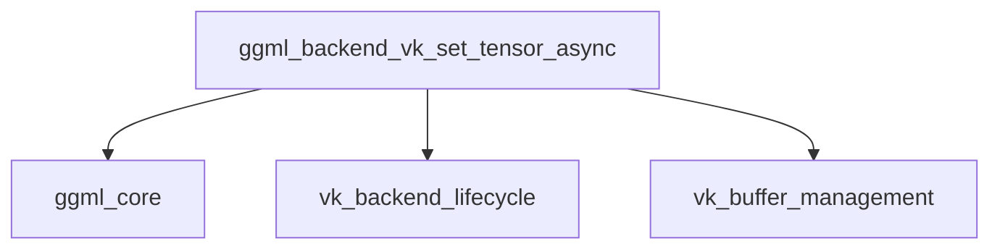

# Module: part_2

## Introduction
The `part_2` module, situated within the `vk_tensor_write_operations` sub-module of `ggml_backend_vulkan`, is dedicated to the asynchronous writing of tensor data to Vulkan-backed memory. Its core purpose is to facilitate efficient and non-blocking data transfer from the host CPU to the GPU device, which is crucial for high-performance machine learning computations.

## Architecture and Component Relationships
This module's primary function is exposed through `ggml_backend_vk_set_tensor_async`, which serves as the entry point for all asynchronous tensor write operations. The function's internal workflow involves several key steps:
1.  **Context Retrieval**: It obtains the global `ggml_backend_vk_context` and the specific `ggml_backend_vk_buffer_context` associated with the target `ggml_tensor`.
2.  **Buffer Type Validation**: It performs an assertion to ensure that the tensor's buffer type is compatible with Vulkan operations, supporting either the default Vulkan buffer type or a host-mappable buffer type. This validation relies on functionalities like `ggml_backend_vk_get_default_buffer_type` and `ggml_backend_vk_host_buffer_type`, which are part of the [vk_buffer_management](vk_buffer_management.md) module.
3.  **Transfer Context Management**: The module manages a `vk_context` specifically for transfer operations. If an existing transfer context has expired, a new one is initialized using `ggml_vk_create_context` and `ggml_vk_ctx_begin`. These context management operations are typically found within the [vk_backend_lifecycle](vk_backend_lifecycle.md) module.
4.  **Asynchronous Data Write**: Finally, it invokes `ggml_vk_buffer_write_async` to perform the actual asynchronous data transfer to the Vulkan buffer. The correct offset within the buffer is calculated using `vk_tensor_offset`, another function provided by [vk_buffer_management](vk_buffer_management.md).

The `ggml_backend_vk_set_tensor_async` function ensures that data is copied to the GPU without blocking the CPU, allowing for concurrent execution of other tasks and improving overall application responsiveness.

## How the Module Fits into the Overall System
The `part_2` module is a fundamental component of the `ggml_backend_vulkan`'s tensor data handling capabilities. It plays a vital role in enabling the efficient transfer of data to Vulkan devices, which is a prerequisite for executing computational graphs on the GPU. By providing asynchronous write operations, it contributes to the non-blocking nature of the `ggml` Vulkan backend, optimizing performance by maximizing GPU utilization and minimizing CPU idle time. It integrates seamlessly with the broader `ggml_core` for tensor definitions and backend abstractions, while relying on other `ggml_backend_vulkan` sub-modules for low-level Vulkan context and buffer management.

<!-- DIAGRAM_JSON
{
    "direction": "TD",
    "nodes": [
        {"id": "ggml_backend_vk_set_tensor_async", "label": "ggml_backend_vk_set_tensor_async", "type": "component", "link": null},
        {"id": "ggml_core", "label": "ggml_core", "type": "external", "link": "ggml_core.md"},
        {"id": "vk_backend_lifecycle", "label": "vk_backend_lifecycle", "type": "external", "link": "vk_backend_lifecycle.md"},
        {"id": "vk_buffer_management", "label": "vk_buffer_management", "type": "external", "link": "vk_buffer_management.md"}
    ],
    "edges": [
        {"source": "ggml_backend_vk_set_tensor_async", "target": "ggml_core"},
        {"source": "ggml_backend_vk_set_tensor_async", "target": "vk_backend_lifecycle"},
        {"source": "ggml_backend_vk_set_tensor_async", "target": "vk_buffer_management"}
    ],
    "groups": []
}
-->

