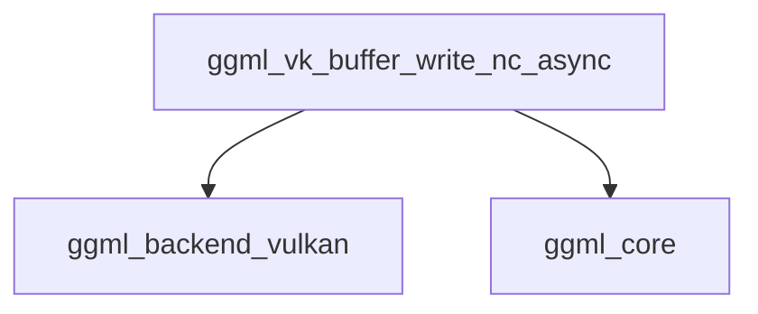

# Module: `part_3`

## Introduction
The `part_3` module, specifically focusing on the `ggml_vk_buffer_write_nc_async` function, is a critical component within the `ggml_backend_vulkan`'s buffer management system. It is responsible for efficiently writing non-contiguous tensor data from host memory to Vulkan device buffers asynchronously. This function is essential for optimizing data transfer operations by leveraging pinned memory and staging buffers to minimize synchronization overhead in Vulkan-based computations.

## Purpose and Core Functionality
The primary purpose of `ggml_vk_buffer_write_nc_async` is to handle the asynchronous transfer of non-contiguous tensor data to Vulkan buffers. Non-contiguous tensors are common in various deep learning operations, and efficiently handling their data movement is crucial for performance.

**Core functionality includes:**
-   **Asynchronous Data Transfer**: Initiates buffer write operations without blocking the CPU, allowing for concurrent computation.
-   **Pinned Memory Optimization**: Detects if the source tensor data resides in pinned host memory. If so, it directly copies slices to the destination Vulkan buffer, treating the pinned memory as a staging buffer.
-   **Staging Buffer Utilization**: For non-pinned host memory, it uses a dedicated synchronous staging buffer to transfer data, ensuring correctness while preparing for asynchronous device copy.
-   **Non-Contiguous Slice Handling**: Meticulously calculates and copies individual slices of non-contiguous tensors to ensure correct layout in the destination Vulkan buffer.
-   **Integration with Vulkan Backend**: Works in conjunction with the `ggml_backend_vk_context` and `vk_context` to manage Vulkan resources and command submissions.

## Architecture and Component Relationships

The `part_3` module's core component, `ggml_vk_buffer_write_nc_async`, interacts with several other modules and components to perform its duties. It resides within the `vk_tensor_write_operations` sub-module of `ggml_backend_vulkan`, indicating its specialized role in writing tensor data.

<!-- DIAGRAM_JSON
{
    "direction": "TD",
    "nodes": [
        {"id": "write_nc_async", "label": "ggml_vk_buffer_write_nc_async", "type": "component", "link": null},
        {"id": "backend_vulkan", "label": "ggml_backend_vulkan", "type": "external", "link": "ggml_backend_vulkan.md"},
        {"id": "core_module", "label": "ggml_core", "type": "external", "link": "ggml_core.md"}
    ],
    "edges": [
        {"source": "write_nc_async", "target": "backend_vulkan"},
        {"source": "write_nc_async", "target": "core_module"}
    ],
    "groups": []
}
-->

### Component Breakdown:

-   **`ggml_vk_buffer_write_nc_async` (Internal Component)**: The central function documented here. It orchestrates the logic for copying non-contiguous tensor data to Vulkan buffers, managing pinned memory and staging buffer usage.

### External Dependencies:

-   **`ggml_backend_vulkan`**: This module provides the core Vulkan backend context, buffer types (`vk_buffer`), and essential utilities like `ggml_vk_host_get`, `ggml_vk_sync_buffers`, and `ggml_vk_ensure_sync_staging_buffer`. These functions are crucial for managing Vulkan device resources, synchronizing operations, and ensuring staging buffers are correctly sized. For more details, refer to the [ggml_backend_vulkan documentation](ggml_backend_vulkan.md).
-   **`ggml_core`**: This module defines fundamental `ggml_tensor` structures and provides utilities for querying tensor properties such as `ggml_is_contiguous`, `ggml_type_size`, `ggml_blck_size`, and `ggml_nelements`. These are used by `ggml_vk_buffer_write_nc_async` to interpret tensor layout and calculate copy sizes. For more information, see the [ggml_core documentation](ggml_core.md).

## How the Module Fits into the Overall System
The `part_3` module, through `ggml_vk_buffer_write_nc_async`, is an integral part of the data transfer layer within the `ggml_backend_vulkan`. It ensures that tensor data, especially complex non-contiguous layouts, can be efficiently moved from the CPU to the Vulkan-enabled GPU for processing. This optimization is critical for reducing bottlenecks in operations that involve frequent data transfers, thereby contributing significantly to the overall performance of `ggml` computations on Vulkan. It forms a key piece of the `vk_tensor_write_operations` which is part of the broader `vk_buffer_management` within the `ggml_backend_vulkan` system.
