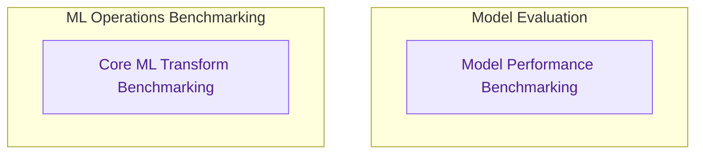

# Performance Benchmarking Module
This module provides tools and tests for evaluating the performance of models and core machine learning transformations. It includes benchmarks for overall model inference with various inputs, as well as granular performance tests for token processing functions.

<!-- DIAGRAM_JSON
{
    "direction": "TD",
    "nodes": [
        {"id": "model_benchmarking", "label": "Model Performance Benchmarking", "type": "module", "link": "model_benchmarking.md"},
        {"id": "core_ml_transform_benchmarking", "label": "Core ML Transform Benchmarking", "type": "module", "link": "core_ml_transform_benchmarking.md"}
    ],
    "edges": [

    ],
    "groups": [
        {"id": "model_eval", "label": "Model Evaluation", "role": "analytical", "nodes": ["model_benchmarking"]},
        {"id": "ml_ops_bench", "label": "ML Operations Benchmarking", "role": "analytical", "nodes": ["core_ml_transform_benchmarking"]}
    ]
}
-->
