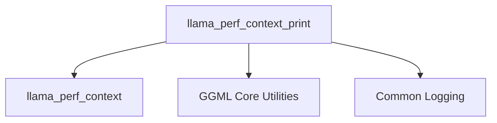

# Performance Logging Module

## Introduction
The `performance_logging` module, a sub-module of `monitoring_and_diagnostics` within `llama_cpp_context`, is responsible for collecting and presenting performance statistics related to the `llama_context`. It provides insights into various operational timings, helping developers and maintainers to understand and optimize the performance of the Llama inference process.

## Architecture and Component Relationships

The `performance_logging` module primarily revolves around the `llama_perf_context_print` function, which orchestrates the retrieval and display of performance data.

<!-- DIAGRAM_JSON
{
    "direction": "TD",
    "nodes": [
        {"id": "llama_perf_context_print", "label": "llama_perf_context_print", "type": "component", "link": null},
        {"id": "llama_perf_context_data", "label": "llama_perf_context", "type": "component", "link": null},
        {"id": "ggml_core", "label": "GGML Core Utilities", "type": "external", "link": "ggml_core.md"},
        {"id": "common_logging", "label": "Common Logging", "type": "external", "link": "common_logging.md"}
    ],
    "edges": [
        {"source": "llama_perf_context_print", "target": "llama_perf_context_data"},
        {"source": "llama_perf_context_print", "target": "ggml_core"},
        {"source": "llama_perf_context_print", "target": "common_logging"}
    ],
    "groups": []
}
-->

### Core Components

#### `llama_perf_context_print`
- **Purpose**: This function is the primary entry point for displaying performance metrics. It retrieves performance data from the `llama_context` and outputs formatted statistics to the log.
- **Details**:
    - It calls `llama_perf_context(ctx)` to obtain a `llama_perf_context` data structure, which contains accumulated performance timings and counts.
    - It uses `ggml_time_us()` to get the current time for calculating total elapsed time since the performance context was started.
    - It logs various performance statistics, including:
        - `load time`: Time taken to load the model.
        - `prompt eval time`: Time spent evaluating the prompt, including tokens per second and milliseconds per token.
        - `eval time`: Time spent during subsequent token generation (evaluation runs), including tokens per second and milliseconds per token.
        - `total time`: The total elapsed time since the performance context began.
        - `graphs reused`: The number of computation graphs that were reused.
    - All logging is performed using `LLAMA_LOG_INFO`, indicating its reliance on the [common_logging.md](common_logging.md) module for output.

#### `llama_perf_context`
- **Purpose**: This component (likely a function or a data structure accessor) is responsible for providing the raw performance data from the `llama_context`. It aggregates various timing and count metrics necessary for performance analysis.
- **Relationship**: It is directly consumed by `llama_perf_context_print` to gather the necessary data for logging.

### External Dependencies

- **[GGML Core Utilities](ggml_core.md)**: The module utilizes `ggml_time_us()` from the GGML library for accurate time measurements, which is crucial for calculating elapsed times and performance rates.
- **[Common Logging](common_logging.md)**: All informational output from `performance_logging` is routed through the `LLAMA_LOG_INFO` macro, which is part of the common logging framework, ensuring consistent and configurable logging behavior across the system.

## How the Module Fits into the Overall System

The `performance_logging` module is an integral part of the `monitoring_and_diagnostics` sub-system within the `llama_cpp_context` module. Its primary role is to provide visibility into the runtime performance of the Llama model, enabling:
- **Performance Analysis**: Developers can use the detailed logs to identify bottlenecks in model loading, prompt processing, and token generation.
- **Optimization Efforts**: By pinpointing areas of high latency or low throughput, maintainers can focus optimization efforts on the most impactful parts of the inference pipeline.
- **System Health Monitoring**: The logged metrics serve as key indicators for monitoring the overall health and efficiency of the Llama.cpp inference engine.

It acts as a diagnostic tool, providing crucial data that helps in both development and production environments to ensure optimal performance of the Llama models.