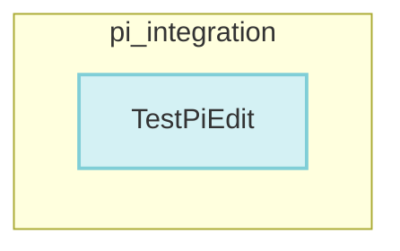

# pi_integration
This module contains tests for the `Pi` configuration system, specifically validating the `Edit` method's ability to manage and update AI model configurations, including Ollama provider settings, within a `models.json` file.

<!-- DIAGRAM_JSON
{
    "nodes": [
        {
            "id": "cmd.launch.pi_test.TestPiEdit",
            "label": "TestPiEdit",
            "type": "test"
        }
    ],
    "edges": [],
    "groups": [
        {
            "id": "pi_integration",
            "label": "pi_integration",
            "nodes": [
                "cmd.launch.pi_test.TestPiEdit"
            ]
        }
    ]
}
-->
