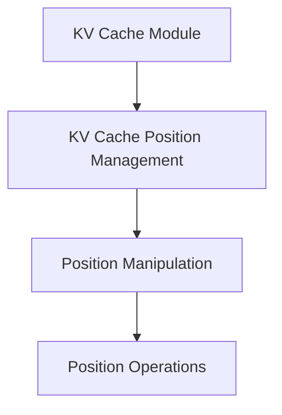

# Position Manipulation Module

## Introduction
The `position_manipulation` module is a critical component within the `kv_cache_position_management` system, responsible for fundamental operations that adjust and manage position indices within the KV cache cells. It ensures the integrity of sequence positions during dynamic operations like shifting or invalidation.

## Architecture
This module is part of the `llama_cpp_kv_cache` and specifically resides under `kv_cache_position_management`. It provides the low-level functions required to modify the positional data associated with KV cache entries.

<!-- DIAGRAM_JSON
{
    "direction": "TD",
    "nodes": [
        {"id": "llama_cpp_kv_cache", "label": "KV Cache Module", "type": "external", "link": "llama_cpp_kv_cache.md"},
        {"id": "kv_cache_position_management", "label": "KV Cache Position Management", "type": "external", "link": "kv_cache_position_management.md"},
        {"id": "position_manipulation", "label": "Position Manipulation", "type": "module", "link": "position_manipulation.md"},
        {"id": "position_operations", "label": "Position Operations", "type": "module", "link": "position_operations.md"}
    ],
    "edges": [
        {"source": "llama_cpp_kv_cache", "target": "kv_cache_position_management"},
        {"source": "kv_cache_position_management", "target": "position_manipulation"},
        {"source": "position_manipulation", "target": "position_operations"}
    ],
    "groups": []
}
-->

## Sub-modules

### Position Operations (`position_operations.md`)
This sub-module encapsulates the core logic for adjusting position values. It includes functions like `pos_add` for incrementing positions and `pos_div` for dividing positions, along with managing associated shifts and invalidating entries when positions fall below zero. It is crucial for maintaining the sequential order and validity of KV cache entries.
