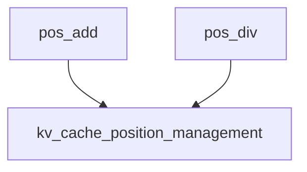

# `position_operations` Module Documentation

## Introduction

The `position_operations` module, located under `llama_cpp_kv_cache.kv_cache_position_management.position_manipulation`, provides fundamental arithmetic operations for managing token positions within the Key-Value (KV) cache of the LLaMA C++ implementation. It is a critical low-level component responsible for updating and maintaining the integrity of position indices and associated shift values for KV cache cells.

## Purpose and Core Functionality

This module's primary purpose is to encapsulate the core logic for modifying position data of individual KV cache cells. It ensures that when token positions change due to operations like shifting or division, the associated internal states (`pos`, `shift`, `seq`, `used`) are consistently updated. The module exposes two main functions:

*   `pos_add`: Adds a delta to a given position, handling potential invalidations.
*   `pos_div`: Divides a given position by a divisor, adjusting the shift accordingly.

These operations are vital for dynamic KV cache management, especially in scenarios involving context shifting, re-indexing, or other sequence manipulations during inference.

### Core Components

#### `pos_add`

```c
bool pos_add(uint32_t i, llama_pos d) {
    assert(i < pos.size());
    assert(pos[i] != -1);

    seq_pos_rm(i);

    pos[i]   += d;
    shift[i] += d;

    has_shift = true;

    if (pos[i] < 0) {
        seq[i].reset();
        pos[i] = -1;
        shift[i] = 0;

        used.erase(i);

        return true;
    }

    seq_pos_add(i);

    return false;
}
```

This function adds a signed delta `d` to the position `pos[i]` of a KV cache cell `i`. It performs the following actions:

1.  **Assertion Checks**: Ensures that the index `i` is valid and the position `pos[i]` is not marked as invalid (`-1`).
2.  **Remove from Sequence Position**: Calls `seq_pos_rm(i)` to temporarily remove the cell's position from sequence tracking before modification.
3.  **Update Position and Shift**: Increments `pos[i]` by `d` and also updates the `shift[i]` value by `d`, indicating a change in the relative position.
4.  **Set `has_shift` Flag**: Sets `has_shift` to `true` to indicate that a position shift has occurred, which might trigger further processing in the KV cache system.
5.  **Handle Invalid Position**: If the resulting `pos[i]` becomes negative (e.g., due to shifting a token out of the valid window), it resets the sequence `seq[i]`, invalidates `pos[i]` to `-1`, clears `shift[i]`, and removes `i` from the `used` set.
6.  **Add to Sequence Position**: If the position remains valid, it calls `seq_pos_add(i)` to re-add the updated cell's position to sequence tracking.
7.  **Return Value**: Returns `true` if the position became invalid and was reset, `false` otherwise.

#### `pos_div`

```c
void pos_div(uint32_t i, int d) {
    assert(i < pos.size());
    assert(pos[i] != -1);

    const llama_pos p_old = pos[i];

    seq_pos_rm(i);

    pos[i]   /= d;
    shift[i] += p_old - pos[i];

    seq_pos_add(i);

    has_shift = true;
}
```

This function divides the position `pos[i]` of a KV cache cell `i` by an integer divisor `d`. It performs the following steps:

1.  **Assertion Checks**: Ensures that the index `i` is valid and the position `pos[i]` is not marked as invalid (`-1`).
2.  **Store Old Position**: Saves the current `pos[i]` as `p_old` before modification.
3.  **Remove from Sequence Position**: Calls `seq_pos_rm(i)` to temporarily remove the cell's position from sequence tracking.
4.  **Update Position**: Divides `pos[i]` by `d`.
5.  **Adjust Shift**: Adjusts `shift[i]` by adding the difference between the old position (`p_old`) and the new position (`pos[i]`). This maintains the correct relative shift value despite the division.
6.  **Add to Sequence Position**: Calls `seq_pos_add(i)` to re-add the updated cell's position to sequence tracking.
7.  **Set `has_shift` Flag**: Sets `has_shift` to `true` to indicate that a position shift has occurred.

## Architecture and Component Relationships

The `position_operations` module is a leaf module nestled within the `llama_cpp_kv_cache` hierarchy. It directly interacts with the core data structures (such as `pos`, `shift`, `seq`, `used`) managed by its parent module, `kv_cache_position_management`, and the broader `llama_cpp_kv_cache` system. The functions `pos_add` and `pos_div` rely on helper functions `seq_pos_rm` and `seq_pos_add`, which are part of the `kv_cache_position_management` module, to maintain consistency in the sequence tracking.

Its position as a low-level utility means it provides the granular operations necessary for higher-level KV cache management policies to implement complex position adjustments efficiently and safely.

## How the Module Fits into the Overall System

The `position_operations` module is an integral part of the `llama_cpp_kv_cache` system. The KV cache is crucial for efficient token generation in large language models by storing previously computed key and value states. Accurate and efficient position management within this cache is paramount for:

*   **Context Management**: Handling dynamic context windows, including shifting, truncation, or re-ordering of tokens.
*   **Performance Optimization**: Ensuring that position updates are performed with minimal overhead.
*   **Correctness**: Maintaining the correct mapping between logical token positions and their physical storage in the KV cache.

By providing robust mechanisms for position arithmetic, this module directly supports the overall stability and performance of the LLaMA C++ inference engine.

<!-- DIAGRAM_JSON
{
    "direction": "TD",
    "nodes": [
        {"id": "pos_add", "label": "pos_add", "type": "component", "link": null},
        {"id": "pos_div", "label": "pos_div", "type": "component", "link": null},
        {"id": "kv_cache_position_management", "label": "kv_cache_position_management", "type": "external", "link": "kv_cache_position_management.md"}
    ],
    "edges": [
        {"source": "pos_add", "target": "kv_cache_position_management"},
        {"source": "pos_div", "target": "kv_cache_position_management"}
    ],
    "groups": []
}
-->
