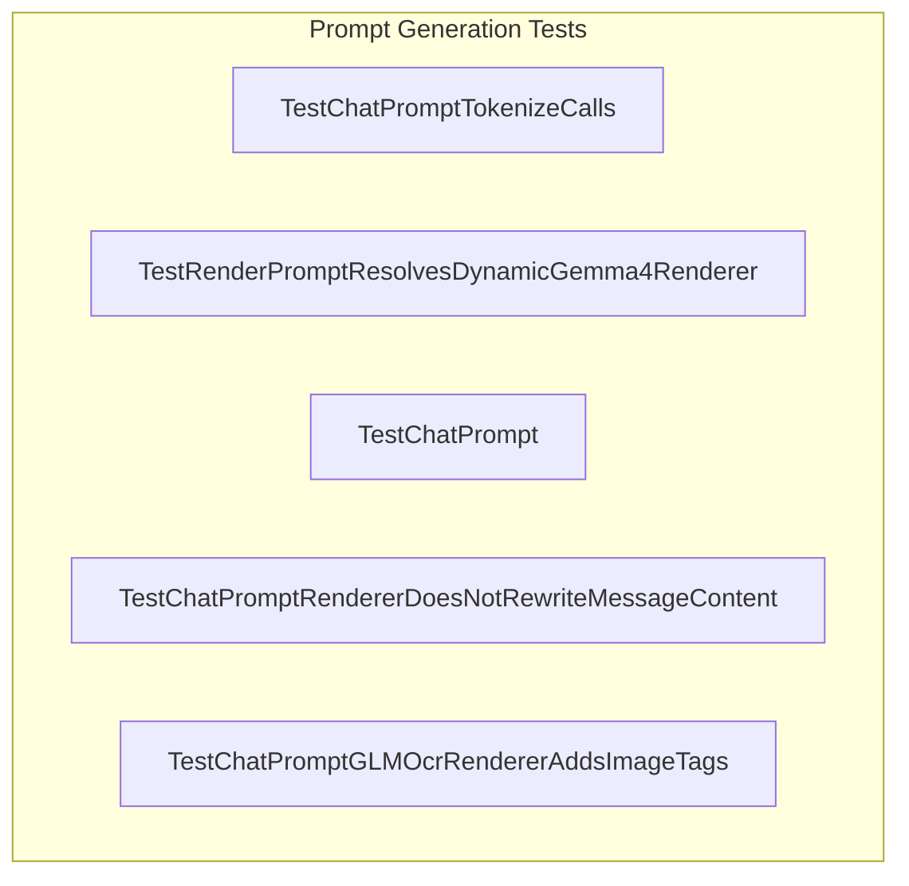

# prompt_generation
This module focuses on generating and rendering prompts for various chat models. It includes tests for message truncation, image processing, specific renderer configurations, and efficient tokenization, ensuring prompt integrity.

<!-- DIAGRAM_JSON
{
    "nodes": [
        {
            "id": "A",
            "label": "TestChatPromptTokenizeCalls"
        },
        {
            "id": "B",
            "label": "TestRenderPromptResolvesDynamicGemma4Renderer"
        },
        {
            "id": "C",
            "label": "TestChatPrompt"
        },
        {
            "id": "D",
            "label": "TestChatPromptRendererDoesNotRewriteMessageContent"
        },
        {
            "id": "E",
            "label": "TestChatPromptGLMOcrRendererAddsImageTags"
        }
    ],
    "edges": [],
    "groups": [
        {
            "id": "G1",
            "label": "Prompt Generation Tests",
            "nodes": [
                "A",
                "B",
                "C",
                "D",
                "E"
            ]
        }
    ]
}
-->
