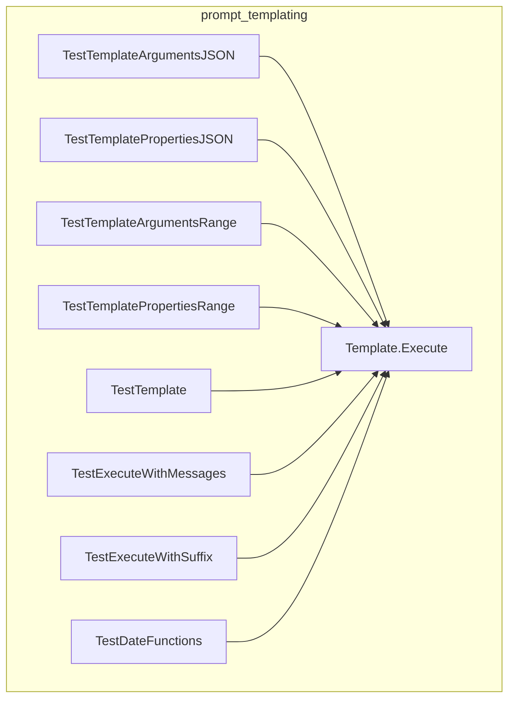

# prompt_templating
This module provides core functionality for executing Go templates tailored for chat-based interactions, handling message collation, tool call arguments, and dynamic content generation, including date functions, to construct prompts and responses.

<!-- DIAGRAM_JSON
{
    "nodes": [
        {
            "id": "A",
            "label": "Template.Execute"
        },
        {
            "id": "B",
            "label": "TestTemplateArgumentsJSON"
        },
        {
            "id": "C",
            "label": "TestTemplatePropertiesJSON"
        },
        {
            "id": "D",
            "label": "TestTemplateArgumentsRange"
        },
        {
            "id": "E",
            "label": "TestTemplatePropertiesRange"
        },
        {
            "id": "F",
            "label": "TestTemplate"
        },
        {
            "id": "G",
            "label": "TestExecuteWithMessages"
        },
        {
            "id": "H",
            "label": "TestExecuteWithSuffix"
        },
        {
            "id": "I",
            "label": "TestDateFunctions"
        }
    ],
    "edges": [
        {
            "source": "B",
            "target": "A"
        },
        {
            "source": "C",
            "target": "A"
        },
        {
            "source": "D",
            "target": "A"
        },
        {
            "source": "E",
            "target": "A"
        },
        {
            "source": "F",
            "target": "A"
        },
        {
            "source": "G",
            "target": "A"
        },
        {
            "source": "H",
            "target": "A"
        },
        {
            "source": "I",
            "target": "A"
        }
    ],
    "groups": [
        {
            "id": "prompt_templating",
            "label": "prompt_templating",
            "nodes": [
                "A",
                "B",
                "C",
                "D",
                "E",
                "F",
                "G",
                "H",
                "I"
            ]
        }
    ]
}
-->
