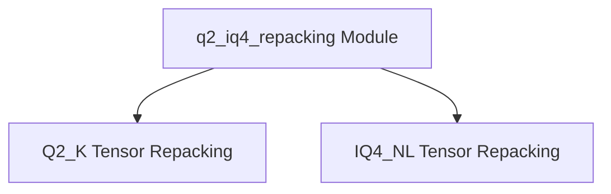

# q2_iq4_repacking Module Documentation

## Introduction

The `q2_iq4_repacking` module is a crucial component within the `ggml_cpu_repack` module, specifically designed for optimizing the performance of quantized tensor operations on the CPU. Its primary purpose is to repack Q2_K and IQ4_NL quantized tensors into interleaved block formats, which can lead to more efficient processing during inference.

This module ensures that tensor data is arranged in a memory layout that is favorable for specific CPU architectures and computational kernels, thereby improving data access patterns and overall computational throughput.

## Architecture Overview

The `q2_iq4_repacking` module is composed of specialized sub-modules, each handling the repacking of a particular type of quantized tensor. The architecture focuses on clear separation of concerns, with dedicated components for different quantization formats and block interleave sizes.

<!-- DIAGRAM_JSON
{
    "direction": "TD",
    "nodes": [
        {"id": "q2_k_repacking", "label": "Q2_K Tensor Repacking", "type": "module", "link": "q2_k_repacking.md"},
        {"id": "iq4_nl_repacking", "label": "IQ4_NL Tensor Repacking", "type": "module", "link": "iq4_nl_repacking.md"}
    ],
    "edges": [],
    "groups": []
}
-->

## Sub-modules

This module contains the following sub-modules:

*   ### [Q2_K Tensor Repacking](q2_k_repacking.md)
    Handles the repacking of Q2_K quantized tensors into an interleaved block format. This is primarily used for optimizing memory access and computation for Q2_K tensors.

*   ### [IQ4_NL Tensor Repacking](iq4_nl_repacking.md)
    Manages the repacking of IQ4_NL quantized tensors for various interleave block sizes. This sub-module provides specialized functions for efficiently arranging IQ4_NL tensor data.
