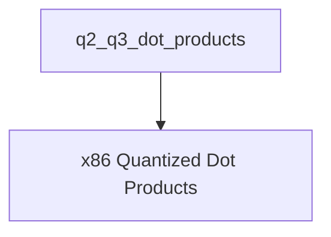

# `q2_q3_dot_products` Module Documentation

## Introduction
The `q2_q3_dot_products` module is a crucial component within the `ggml-cpu` backend, specifically designed for highly optimized quantized vector dot product operations on x86 architectures. It provides specialized implementations for `Q2_K` (2-bit quantized) and `Q3_K` (3-bit quantized) blocks against `Q8_K` (8-bit quantized) blocks, leveraging AVX2 and AVX intrinsics for maximum performance. This module is essential for efficient inference with quantized models in `ggml`.

## Architecture Overview
This module resides within the `ggml_cpu_x86_quants` hierarchy, specifically under `x86_vec_dot_k_quants` -> `standard_k_vec_dots`. It directly interfaces with lower-level CPU instructions to provide accelerated computations for specific quantization schemes. Its primary role is to execute dot product operations as part of larger matrix multiplications, contributing to the overall performance of quantized neural network inference. It conceptually relies on modules like `ggml_cpu_arm_quants` and `ggml_cpu_x86_quants` for general quantization utilities and broader context, though direct dependencies are on the lower-level `ggml-cpu` components.

## Module Structure
The `q2_q3_dot_products` module is organized into a single sub-module to manage its specialized vector dot product implementations.

### Sub-modules
*   **[x86_quantized_dot_products](x86_quantized_dot_products.md)**: Contains the core implementations for AVX/AVX2 optimized dot products between Q2_K/Q3_K and Q8_K quantized blocks.

<!-- DIAGRAM_JSON
{
    "direction": "TD",
    "nodes": [
        {"id": "x86_quantized_dot_products", "label": "x86 Quantized Dot Products", "type": "module", "link": "x86_quantized_dot_products.md"}
    ],
    "edges": [],
    "groups": []
}
-->

