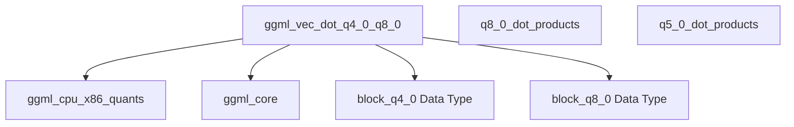

# q4_0_dot_products Module Documentation

## Introduction
The `q4_0_dot_products` module is a specialized component within the GGML library, providing highly optimized implementations for the vector dot product operation involving `Q4_0` quantized data and `Q8_0` quantized data on x86 architectures. This module is critical for efficient execution of neural network inference, particularly when models utilize 4-bit and 8-bit quantization schemes to reduce memory footprint and improve computational speed.

## Architecture and Component Relationships

The `q4_0_dot_products` module primarily contains the `ggml_vec_dot_q4_0_q8_0` function, which is a low-level kernel designed for maximum performance through the use of x86 SIMD instruction sets such as AVX2, AVX, and SSSE3. This function efficiently computes the dot product of two vectors, where one vector consists of `Q4_0` quantized blocks and the other of `Q8_0` quantized blocks.

The core functionality relies on:
*   **Quantized Block Structures:** It operates on `block_q4_0` and `block_q8_0` data types, which define the structure of the 4-bit and 8-bit quantized blocks, respectively. These fundamental types are part of the broader GGML core definitions.
*   **CPU-Specific Optimizations:** The implementation includes conditional compilation directives (`#if defined(__AVX2__)`, `#elif defined(__AVX__)`, `#elif defined(__SSSE3__)`) to leverage the most advanced SIMD instruction set available on the host x86 CPU, ensuring optimal throughput for vector operations.
*   **Helper Functions and Macros:** It utilizes various internal helper functions (e.g., `bytes_from_nibbles_32`, `mul_sum_i8_pairs_float`, `hsum_float_8`, `mul_add_epi8_sse`, `sum_i16_pairs_float`, `quad_fp16_delta_float`, `hsum_float_4x4`, `mul_sum_i8_pairs`) and macros (`GGML_CPU_FP16_TO_FP32`) that are common within the `ggml_cpu_x86_quants` and `ggml_core` modules for handling quantization specifics and floating-point conversions.

### Module Diagram

<!-- DIAGRAM_JSON
{
    "direction": "TD",
    "nodes": [
        {"id": "ggml_vec_dot_q4_0_q8_0", "label": "ggml_vec_dot_q4_0_q8_0", "type": "component", "link": null},
        {"id": "ggml_cpu_x86_quants", "label": "ggml_cpu_x86_quants", "type": "external", "link": "ggml_cpu_x86_quants.md"},
        {"id": "ggml_core", "label": "ggml_core", "type": "external", "link": "ggml_core.md"},
        {"id": "q8_0_dot_products", "label": "q8_0_dot_products", "type": "external", "link": "q8_0_dot_products.md"},
        {"id": "q5_0_dot_products", "label": "q5_0_dot_products", "type": "external", "link": "q5_0_dot_products.md"},
        {"id": "block_q4_0", "label": "block_q4_0 Data Type", "type": "external", "link": "ggml_quantization.md"},
        {"id": "block_q8_0", "label": "block_q8_0 Data Type", "type": "external", "link": "ggml_quantization.md"}
    ],
    "edges": [
        {"source": "ggml_vec_dot_q4_0_q8_0", "target": "ggml_cpu_x86_quants"},
        {"source": "ggml_vec_dot_q4_0_q8_0", "target": "ggml_core"},
        {"source": "ggml_vec_dot_q4_0_q8_0", "target": "block_q4_0"},
        {"source": "ggml_vec_dot_q4_0_q8_0", "target": "block_q8_0"}
    ],
    "groups": []
}
-->

## How the Module Fits into the Overall System
The `q4_0_dot_products` module is an integral part of the `ggml_cpu_x86_quants` family, which is responsible for providing highly optimized quantization kernels for x86 CPUs within the GGML library. It specifically handles the dot product operations for `Q4_0` and `Q8_0` quantized tensors, which are common formats for reduced-precision models.

This module contributes to the overall system by:
*   **Enabling Efficient Quantized Inference:** By offering highly optimized dot product implementations, it directly supports the efficient execution of quantized models on x86 CPUs, reducing computational cost and improving inference speed.
*   **Leveraging Hardware Accelerations:** The use of SIMD intrinsics (AVX2, AVX, SSSE3) ensures that the computations fully utilize the capabilities of modern x86 processors, maximizing performance.
*   **Providing a Core Building Block:** It acts as a fundamental computational primitive that other higher-level operations within GGML (e.g., matrix multiplications, convolutions) can utilize when dealing with `Q4_0` and `Q8_0` quantized data.

It is a leaf module under `x86_vec_dot_0_quants`, which in turn is part of `standard_quantized_dot_products` within the broader `ggml_cpu_x86_quants` module. This hierarchical structure ensures that different quantization schemes and CPU architectures have dedicated and optimized implementations. Sibling modules like [q8_0_dot_products](q8_0_dot_products.md) and [q5_0_dot_products](q5_0_dot_products.md) handle similar operations for other quantization types, demonstrating a consistent approach to optimizing quantized computations.
