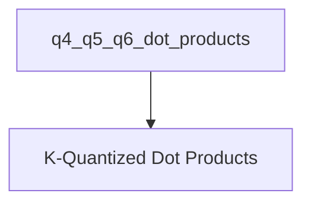

# q4_q5_q6_dot_products Module Documentation

## Introduction and Purpose

The `q4_q5_q6_dot_products` module is a specialized component within the `ggml_cpu_x86_quants` module, focusing on highly optimized vector dot product operations for K-quantized tensors on x86 architectures. This module provides efficient implementations for calculating dot products between 4-bit, 5-bit, and 6-bit K-quantized input tensors and 8-bit K-quantized weight tensors. These operations are critical for performance in quantized neural network inference.

## Architecture Overview

The `q4_q5_q6_dot_products` module encapsulates the core functions for performing these specific dot product calculations. It is a sub-module of `standard_k_vec_dots` and ultimately resides within the `ggml_cpu_x86_quants` hierarchy, which handles x86 CPU-specific quantization routines. The primary sub-module within `q4_q5_q6_dot_products` is `k_quantized_dot_products`, which contains the individual dot product implementations.

<!-- DIAGRAM_JSON
{
    "direction": "TD",
    "nodes": [
        {"id": "q4_q5_q6_dot_products", "label": "Q4/Q5/Q6 Dot Products", "type": "module"},
        {"id": "k_quantized_dot_products", "label": "K-Quantized Dot Products", "type": "module", "link": "k_quantized_dot_products.md"}
    ],
    "edges": [
        {"source": "q4_q5_q6_dot_products", "target": "k_quantized_dot_products"}
    ],
    "groups": []
}
-->

## Sub-modules

### [K-Quantized Dot Products](k_quantized_dot_products.md)

This sub-module provides the concrete implementations for the K-quantized vector dot product functions. It includes optimized routines, leveraging AVX/AVX2 intrinsics where available, to accelerate computations for `q4_K`, `q5_K`, and `q6_K` tensors against `q8_K` tensors. These functions are highly specialized for performance in CPU-bound quantized inference scenarios.