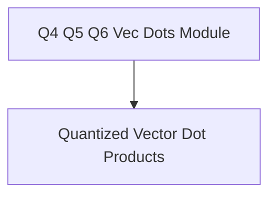

# q4_q5_q6_vec_dots Module Documentation

## Introduction
The `q4_q5_q6_vec_dots` module provides highly optimized vector dot product implementations specifically tailored for ARM architectures. It focuses on operations involving quantized tensors of types Q4_K, Q5_K, and Q6_K with Q8_K quantized tensors, which are crucial for efficient machine learning inference on ARM-based systems. This module is a key component within the `arm_vec_dot_k_quants` family, contributing to the performance of quantized model execution.

## Architecture
The `q4_q5_q6_vec_dots` module is structured around its core responsibility: providing specialized vector dot product kernels. It encapsulates these functionalities within a dedicated sub-module for clarity and maintainability.

<!-- DIAGRAM_JSON
{
    "direction": "TD",
    "nodes": [
        {"id": "q4_q5_q6_vec_dots_module", "label": "Q4 Q5 Q6 Vec Dots Module", "type": "module", "link": "q4_q5_q6_vec_dots.md"},
        {"id": "quantized_vec_dot_kernels", "label": "Quantized Vector Dot Products", "type": "module", "link": "quantized_vec_dot_kernels.md"}
    ],
    "edges": [
        {"source": "q4_q5_q6_vec_dots_module", "target": "quantized_vec_dot_kernels"}
    ],
    "groups": []
}
-->

## Sub-modules
### Quantized Vector Dot Products (`quantized_vec_dot_kernels`)
This sub-module contains the ARM-optimized kernels for performing vector dot products between Q4_K, Q5_K, or Q6_K quantized inputs and Q8_K quantized weights. These functions are critical for accelerating inference tasks by leveraging the specific features of ARM processors.

For detailed information, refer to the [Quantized Vector Dot Products](quantized_vec_dot_kernels.md) documentation.
