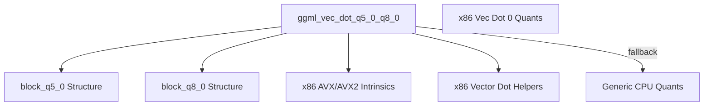

# q5_0_dot_products Module Documentation

## Introduction

The `q5_0_dot_products` module is a specialized component within the `ggml` library, focusing on highly optimized vector dot product computations for `q5_0` and `q8_0` quantized tensors on x86 architectures. This module is critical for achieving efficient inference performance in machine learning models that leverage these specific quantization schemes, particularly when running on CPUs with AVX/AVX2 instruction sets.

## Architecture and Component Relationships

This module provides the core function `ggml_vec_dot_q5_0_q8_0`, which implements the vector dot product operation. It is designed to maximize performance by utilizing x86-specific CPU intrinsics (AVX2, AVX) for accelerated computation. In the absence of these instruction sets, it gracefully falls back to a generic C implementation.

### Core Functionality

The `ggml_vec_dot_q5_0_q8_0` function takes two quantized blocks, `block_q5_0` and `block_q8_0`, and computes their dot product, returning the result as a float. It meticulously handles the decompression and multiplication of quantized values, accumulating the sum efficiently. The use of combined scales for blocks and specialized intrinsic functions (`bytes_from_nibbles_32`, `bytes_from_bits_32`, `mul_sum_i8_pairs_float`, `hsum_float_8`) underlines its focus on performance.

<!-- DIAGRAM_JSON
{
    "direction": "TD",
    "nodes": [
        {"id": "ggml_vec_dot_q5_0_q8_0", "label": "ggml_vec_dot_q5_0_q8_0", "type": "component", "link": null},
        {"id": "q5_0_block_struct", "label": "block_q5_0 Structure", "type": "external", "link": "ggml_quantization.md"},
        {"id": "q8_0_block_struct", "label": "block_q8_0 Structure", "type": "external", "link": "ggml_quantization.md"},
        {"id": "x86_avx_intrinsics", "label": "x86 AVX/AVX2 Intrinsics", "type": "component", "link": null},
        {"id": "x86_vec_dot_helpers", "label": "x86 Vector Dot Helpers", "type": "component", "link": null},
        {"id": "ggml_cpu_quants_generic", "label": "Generic CPU Quants", "type": "external", "link": "ggml_cpu_quants_generic.md"},
        {"id": "x86_vec_dot_0_quants", "label": "x86 Vec Dot 0 Quants", "type": "external", "link": "x86_vec_dot_0_quants.md"}
    ],
    "edges": [
        {"source": "ggml_vec_dot_q5_0_q8_0", "target": "q5_0_block_struct"},
        {"source": "ggml_vec_dot_q5_0_q8_0", "target": "q8_0_block_struct"},
        {"source": "ggml_vec_dot_q5_0_q8_0", "target": "x86_avx_intrinsics"},
        {"source": "ggml_vec_dot_q5_0_q8_0", "target": "x86_vec_dot_helpers"},
        {"source": "ggml_vec_dot_q5_0_q8_0", "target": "ggml_cpu_quants_generic", "label": "fallback"}
    ],
    "groups": []
}
-->

## How the Module Fits into the Overall System

The `q5_0_dot_products` module is an integral part of the `ggml_cpu_x86_quants` component, which is responsible for providing highly optimized quantization kernels for x86 CPUs within the larger [ggml_backend_core.md](ggml_backend_core.md) framework.

It specifically sits under the [x86_vec_dot_0_quants.md](x86_vec_dot_0_quants.md) module, contributing to a collection of optimized vector dot product implementations for various quantization types. This module plays a crucial role in the overall performance of `ggml`-based applications on x86 platforms by accelerating fundamental tensor operations, directly impacting the speed and efficiency of quantized large language models and other neural networks during inference. Its optimized routines minimize computational overhead, making it a cornerstone for CPU-bound machine learning tasks.
