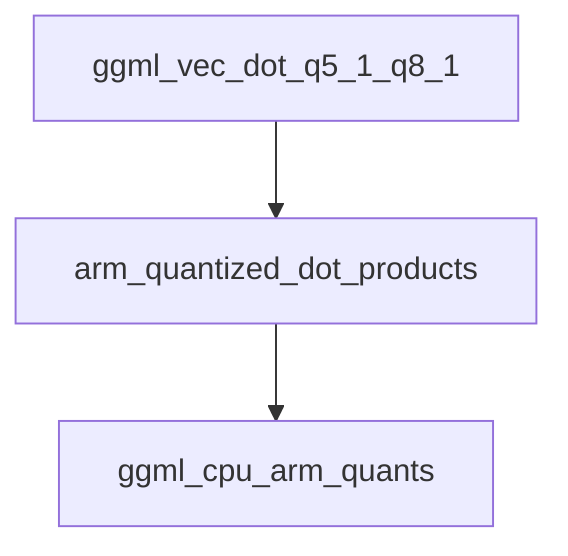

# q5_1_dot_product_arm Module Documentation

This module provides the core implementation for the `q5_1` and `q8_1` quantized vector dot product operations, specifically optimized for ARM processors using NEON intrinsics. It is a fundamental component for efficient inference with quantized models on ARM-based systems within the GGML framework.

## Purpose and Core Functionality

The `q5_1_dot_product_arm` module's primary function is to compute the dot product between two vectors: one quantized in `q5_1` format and the other in `q8_1` format. This operation is critical in various machine learning computations, especially in neural network inference where model weights and activations are often quantized to reduce memory footprint and improve performance.

The core functionality is encapsulated in the `ggml_vec_dot_q5_1_q8_1` function:

### `ggml_vec_dot_q5_1_q8_1`

```c
void ggml_vec_dot_q5_1_q8_1(int n, float * GGML_RESTRICT s, size_t bs, const void * GGML_RESTRICT vx, size_t bx, const void * GGML_RESTRICT vy, size_t by, int nrc)
```

This function performs the dot product of `q5_1` and `q8_1` quantized vectors.

*   **Parameters**:
    *   `n`: The total number of elements in the vectors.
    *   `s`: A pointer to the float where the final dot product sum will be stored.
    *   `vx`: Pointer to the first vector (type `block_q5_1`).
    *   `vy`: Pointer to the second vector (type `block_q8_1`).
    *   `bs`, `bx`, `by`, `nrc`: Additional parameters for block sizes and row count, with specific assertions (`nrc == 1`) implying a single row calculation.
*   **Quantization Formats**:
    *   `q5_1`: A 5-bit quantization format, where each block contains 16 elements. It stores 4 bits per value in `qs`, and the 5th bit (sign or high bit) in `qh`, along with a block-wise scale (`d`) and mean (`m`).
    *   `q8_1`: An 8-bit quantization format, where each block contains 16 elements. It stores 8 bits per value in `qs`, along with a block-wise scale (`s`) and mean (`m`).
*   **Optimization**: The function is heavily optimized for ARM processors leveraging the NEON instruction set. It processes data in 16-element blocks (`QK5_1`, `QK8_1`) and utilizes NEON intrinsics for parallel operations such as vector loads (`vld1q_u8`, `vld1q_s8`), bitwise operations (`vandq_u8`, `vshrq_n_u8`, `vorrq_s8`), conversions (`vcvtq_f32_s32`), and fused multiply-add (`vmlaq_n_f32`). A lookup table (`table_b2b_0`) is used to efficiently extract the 5th bit for the `q5_1` format.
*   **Fallback Mechanism**: In cases where ARM NEON is not available or for remaining blocks, a scalar fallback loop is provided to ensure correct computation, albeit at a lower performance.

## Architecture and Component Relationships

The `q5_1_dot_product_arm` module is a leaf module within the `ggml_cpu_arm_quants` hierarchy. It directly implements a specialized dot product function essential for quantized operations on ARM CPUs.

<!-- DIAGRAM_JSON
{
    "direction": "TD",
    "nodes": [
        {"id": "ggml_vec_dot_q5_1_q8_1", "label": "ggml_vec_dot_q5_1_q8_1", "type": "component", "link": null},
        {"id": "arm_quantized_dot_products", "label": "arm_quantized_dot_products", "type": "external", "link": "arm_quantized_dot_products.md"},
        {"id": "ggml_cpu_arm_quants", "label": "ggml_cpu_arm_quants", "type": "external", "link": "ggml_cpu_arm_quants.md"}
    ],
    "edges": [
        {"source": "ggml_vec_dot_q5_1_q8_1", "target": "arm_quantized_dot_products"},
        {"source": "arm_quantized_dot_products", "target": "ggml_cpu_arm_quants"}
    ],
    "groups": []
}
-->


*   **`ggml_vec_dot_q5_1_q8_1`**: The core function provided by this module, performing the specialized dot product.
*   **`arm_quantized_dot_products`**: This module acts as the direct parent, likely defining or coordinating various ARM-optimized quantized dot product implementations. It provides the context and potentially common structures (like `block_q5_1` and `block_q8_1`) and constants (`QK5_1`, `QK8_1`) used by `ggml_vec_dot_q5_1_q8_1`.
*   **`ggml_cpu_arm_quants`**: The higher-level module that encompasses all ARM-specific CPU quantization routines. It orchestrates the usage of specialized functions like `ggml_vec_dot_q5_1_q8_1` to provide a comprehensive set of quantization primitives for ARM architectures.

## How the Module Fits into the Overall System

The `q5_1_dot_product_arm` module is a low-level, performance-critical component within the broader GGML (Georgi Gerganov's Machine Learning library) ecosystem. It specifically targets ARM CPUs to accelerate operations involving `q5_1` and `q8_1` quantized tensors.

In the context of the GGML library, which is widely used for efficient on-device machine learning inference (e.g., in `llama.cpp`), this module contributes to the overall performance of quantized models. By providing highly optimized vector dot product implementations, it significantly reduces the computational overhead for operations like matrix multiplications and convolutions, which are fundamental to transformer models.

This module is part of the `ggml_cpu_arm_quants` family, which is one of several CPU-specific quantization implementations (alongside `ggml_cpu_x86_quants`). This modular design allows GGML to leverage architecture-specific optimizations, ensuring the best possible performance across different hardware platforms. Applications built on `llama.cpp` or other GGML-powered frameworks will indirectly benefit from the optimizations provided by this module when running on ARM-based devices.
