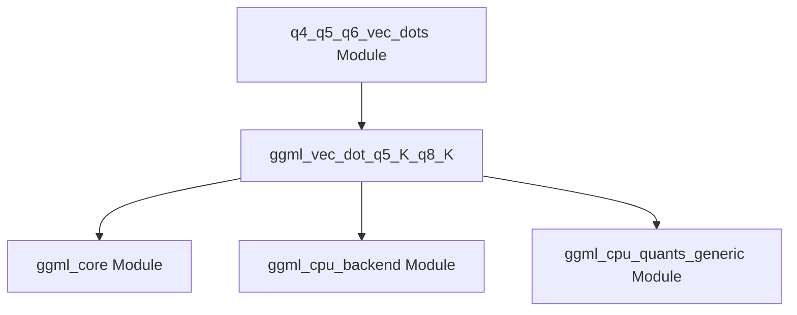

# q5_vec_dot_kernel Module Documentation

## Introduction
The `q5_vec_dot_kernel` module provides highly optimized vector dot product kernels specifically for Q5_K quantized tensors on ARM architectures. This module is a crucial component within the `ggml` library's CPU backend, enabling efficient execution of quantized neural network operations.

## Purpose and Core Functionality
The primary purpose of this module is to implement the `ggml_vec_dot_q5_K_q8_K` kernel. This function performs a vector dot product between a Q5_K quantized vector and a Q8_K quantized vector, which is a common operation in many modern neural network models when operating on quantized weights and activations. The implementation is heavily optimized for ARM CPUs, leveraging specific architectural features to maximize performance for `ggml` operations.

## Architecture and Component Relationships

<!-- DIAGRAM_JSON
{
    "direction": "TD",
    "nodes": [
        {"id": "ggml_vec_dot_q5_K_q8_K", "label": "ggml_vec_dot_q5_K_q8_K", "type": "component", "link": null},
        {"id": "q4_q5_q6_vec_dots", "label": "q4_q5_q6_vec_dots Module", "type": "external", "link": "q4_q5_q6_vec_dots.md"},
        {"id": "ggml_cpu_arm_quants", "label": "ggml_cpu_arm_quants Module", "type": "external", "link": "ggml_cpu_arm_quants.md"},
        {"id": "ggml_core", "label": "ggml_core Module", "type": "external", "link": "ggml_core.md"},
        {"id": "ggml_cpu_backend", "label": "ggml_cpu_backend Module", "type": "external", "link": "ggml_cpu_backend.md"},
        {"id": "ggml_cpu_quants_generic", "label": "ggml_cpu_quants_generic Module", "type": "external", "link": "ggml_cpu_quants_generic.md"}
    ],
    "edges": [
        {"source": "q4_q5_q6_vec_dots", "target": "ggml_vec_dot_q5_K_q8_K"},
        {"source": "ggml_vec_dot_q5_K_q8_K", "target": "ggml_core"},
        {"source": "ggml_vec_dot_q5_K_q8_K", "target": "ggml_cpu_backend"},
        {"source": "ggml_vec_dot_q5_K_q8_K", "target": "ggml_cpu_quants_generic"}
    ],
    "groups": []
}
-->



The `q5_vec_dot_kernel` module, through its `ggml_vec_dot_q5_K_q8_K` component, is a specialized implementation within the broader `q4_q5_q6_vec_dots` module. This kernel is invoked when performing vector dot products involving Q5_K and Q8_K quantized data types. It relies on fundamental data structures and utility functions provided by the [ggml_core module](ggml_core.md) and integrates with the overall [ggml_cpu_backend module](ggml_cpu_backend.md) for execution on ARM processors. Additionally, it may utilize generic quantization helper functions from the [ggml_cpu_quants_generic module](ggml_cpu_quants_generic.md). The higher-level [ggml_cpu_arm_quants module](ggml_cpu_arm_quants.md) orchestrates the use of such specific kernels for ARM-based quantization operations.

## How the Module Fits into the Overall System
The `q5_vec_dot_kernel` module is a low-level, performance-critical component of the `ggml` machine learning inference engine. It specifically addresses the need for efficient computation with Q5_K quantized tensors on ARM CPUs. By providing an optimized implementation for this particular vector dot product, it contributes to the overall speed and efficiency of models that utilize Q5_K quantization, especially on mobile and embedded ARM devices. It is part of a hierarchy of quantization-specific kernels, ensuring that `ggml` can leverage the best possible performance for various quantization schemes and CPU architectures.

## Introduction
The `q5_vec_dot_kernel` module provides an ARM NEON optimized kernel for computing the vector dot product between `q5_K` and `q8_K` quantized tensors. This optimization is crucial for achieving high performance in GGML-based models on ARM CPU architectures.

## Architecture and Component Relationships

This module contains a single core function that implements the specialized vector dot product. It relies on fundamental GGML quantization types and provides a highly optimized implementation for specific ARM processors.

<!-- DIAGRAM_JSON
{
    "direction": "TD",
    "nodes": [
        {"id": "ggml_vec_dot_q5_K_q8_K_func", "label": "ggml_vec_dot_q5_K_q8_K (ARM NEON Kernel)", "type": "component", "link": null},
        {"id": "ggml_quant_types", "label": "GGML Quantization Types (block_q5_K, block_q8_K)", "type": "external", "link": "ggml_core.md"},
        {"id": "ggml_cpu_quants_generic_module", "label": "ggml_cpu_quants_generic (Generic Fallback)", "type": "external", "link": "ggml_cpu_quants_generic.md"},
        {"id": "quantized_vec_dot_kernels_module", "label": "quantized_vec_dot_kernels (Parent Module)", "type": "external", "link": "quantized_vec_dot_kernels.md"}
    ],
    "edges": [
        {"source": "ggml_vec_dot_q5_K_q8_K_func", "target": "ggml_quant_types"},
        {"source": "ggml_vec_dot_q5_K_q8_K_func", "target": "ggml_cpu_quants_generic_module"},
        {"source": "quantized_vec_dot_kernels_module", "target": "ggml_vec_dot_q5_K_q8_K_func"}
    ],
    "groups": []
}
-->

```mermaid
graph TD
    ggml_vec_dot_q5_K_q8_K_func[ggml_vec_dot_q5_K_q8_K (ARM NEON Kernel)]
    ggml_quant_types[GGML Quantization Types (block_q5_K, block_q8_K)]
    ggml_cpu_quants_generic_module[ggml_cpu_quants_generic (Generic Fallback)]
    quantized_vec_dot_kernels_module[quantized_vec_dot_kernels (Parent Module)]

    ggml_vec_dot_q5_K_q8_K_func --> ggml_quant_types
    ggml_vec_dot_q5_K_q8_K_func --> ggml_cpu_quants_generic_module
    quantized_vec_dot_kernels_module --> ggml_vec_dot_q5_K_q8_K_func
```

### Internal Components

*   **`ggml_vec_dot_q5_K_q8_K`**:
    This is the primary function within the module. It implements the dot product operation for `Q5_K` and `Q8_K` quantized block tensors, leveraging ARM NEON intrinsics for accelerated computation. The function takes the tensor size `n`, pointers to the output scalar `s`, input `x` (q5_K) and `y` (q8_K) data, and other parameters. It performs block-wise processing, unquantizing values, multiplying them, and accumulating the results. In the absence of ARM NEON support, it defers to a generic implementation.

### External Dependencies

*   **[GGML Quantization Types (block_q5_K, block_q8_K)](ggml_core.md)**:
    The `ggml_vec_dot_q5_K_q8_K` function operates directly on `block_q5_K` and `block_q8_K` data structures. These structures define the format of the quantized tensors used within the GGML library, including scales, mins, and quantized data. They are fundamental data types for GGML's quantization schemes, likely defined in the [ggml_core](../ggml_core.md) module.

*   **[ggml_cpu_quants_generic](ggml_cpu_quants_generic.md)**:
    This module provides generic, non-architecture-specific implementations for quantized vector dot products. The `ggml_vec_dot_q5_K_q8_K` function includes a fallback mechanism to call `ggml_vec_dot_q5_K_q8_K_generic` if ARM NEON optimizations are not enabled or available, ensuring basic functionality across different CPU configurations.

*   **[quantized_vec_dot_kernels](quantized_vec_dot_kernels.md)**:
    This module is the direct parent of `q5_vec_dot_kernel` in the module hierarchy. It serves as a collection point for various specialized quantized vector dot product kernels. The `q5_vec_dot_kernel` module contributes its ARM NEON optimized `q5_K_q8_K` dot product implementation to this broader set of kernels.

## How it Fits into the Overall System

The `q5_vec_dot_kernel` module is a vital, performance-critical component within the GGML library's CPU backend, specifically tailored for ARM architectures. It underpins the efficient execution of neural network models that utilize `q5_K` and `q8_K` quantization methods. By providing a highly optimized, low-level dot product kernel, it directly contributes to:
*   **Faster Inference:** Significant speedups for model inference on ARM-based devices.
*   **Reduced Memory Footprint:** Efficient handling of quantized data blocks minimizes memory usage.
*   **Platform Specific Optimization:** It exemplifies GGML's strategy of leveraging specific hardware features (like ARM NEON) to maximize computational efficiency.

This module is part of a larger family of quantized arithmetic operations, ensuring that GGML can effectively run quantized models across a range of hardware with optimal performance.