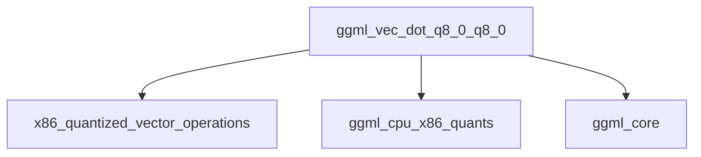

# q8_0_dot_products Module Documentation

The `q8_0_dot_products` module is a crucial component within the GGML library, specifically designed to provide highly optimized vector dot product computations for `Q8_0` quantized data on x86 architectures. This module serves as a low-level, high-performance kernel that significantly accelerates neural network inference operations by leveraging processor-specific instruction sets like AVX and AVX2.

### Module Overview

The primary function of the `q8_0_dot_products` module is to implement the `ggml_vec_dot_q8_0_q8_0` routine. This function performs the dot product between two vectors, `vx` and `vy`, which are composed of `Q8_0` quantized blocks. By efficiently processing these quantized blocks, the module contributes to the overall speed and efficiency of GGML's CPU-based computations, particularly for models that utilize `Q8_0` quantization for reduced memory footprint and faster execution.

### Architecture and Component Relationships

The `q8_0_dot_products` module is a leaf module nestled deep within the `ggml_cpu_x86_quants` hierarchy. It is a specialized implementation providing the core `Q8_0` dot product functionality that is utilized by higher-level quantization routines.

The `ggml_vec_dot_q8_0_q8_0` function within this module directly processes `block_q8_0` structures. It contains optimized code paths for `__AVX2__` and `__AVX__` instruction sets, allowing it to exploit Single Instruction, Multiple Data (SIMD) capabilities of modern x86 CPUs. These optimized paths use intrinsic functions (e.g., `_mm256_setzero_ps`, `_mm256_fmadd_ps`) to perform parallel arithmetic operations, significantly speeding up the dot product calculation. A generic fallback loop is also provided for systems without these specific instruction sets.

#### Relationship with other modules:

*   **x86_quantized_vector_operations**: This module is a direct child of `x86_quantized_vector_operations`, inheriting the context of x86-specific quantized vector processing.
*   **ggml_cpu_x86_quants**: It is part of the broader `ggml_cpu_x86_quants` module, which encompasses all x86 CPU-specific quantization routines.
*   **ggml_core**: It depends on `ggml_core` for fundamental GGML definitions, such as the structure of `block_q8_0` and constants like `QK8_0`, which define the quantization block size.

<!-- DIAGRAM_JSON
{
    "direction": "TD",
    "nodes": [
        {"id": "q8_0_dot_product_function", "label": "ggml_vec_dot_q8_0_q8_0", "type": "component", "link": null},
        {"id": "x86_quantized_vector_operations", "label": "x86_quantized_vector_operations", "type": "external", "link": "x86_quantized_vector_operations.md"},
        {"id": "ggml_cpu_x86_quants", "label": "ggml_cpu_x86_quants", "type": "external", "link": "ggml_cpu_x86_quants.md"},
        {"id": "ggml_core", "label": "ggml_core", "type": "external", "link": "ggml_core.md"}
    ],
    "edges": [
        {"source": "q8_0_dot_product_function", "target": "x86_quantized_vector_operations"},
        {"source": "q8_0_dot_product_function", "target": "ggml_cpu_x86_quants"},
        {"source": "q8_0_dot_product_function", "target": "ggml_core"}
    ],
    "groups": []
}
-->

### How the Module Fits into the Overall System

The `q8_0_dot_products` module provides a fundamental building block for efficient quantized tensor operations within the GGML framework. By offering highly optimized dot product kernels for `Q8_0` data, it directly supports the efficient execution of quantized neural network models on x86 CPUs. This optimization is critical for achieving high inference speeds with reduced memory bandwidth requirements, making GGML suitable for running large language models and other deep learning applications on commodity hardware. Its position as a specialized low-level kernel ensures that the performance gains are propagated up through the GGML computation graph, benefiting all operations that rely on `Q8_0` dot products.