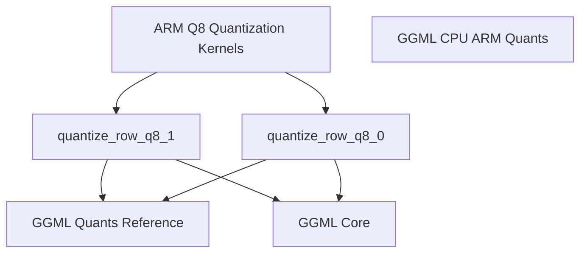

# q8_quantization_kernels Module Documentation

## Introduction

The `q8_quantization_kernels` module provides optimized quantization kernels specifically designed for ARM NEON architectures. These kernels are crucial for efficient processing of 8-bit quantized tensors, a common technique in machine learning to reduce memory footprint and improve computational speed. This module implements the core logic for converting 32-bit floating-point data into 8-bit quantized formats, `Q8_0` and `Q8_1`, leveraging ARM's SIMD capabilities.

## Core Functionality

This module contains two primary functions responsible for the quantization process:

### `quantize_row_q8_0`

`quantize_row_q8_0` is designed to quantize a row of 32-bit floating-point numbers into the `block_q8_0` format. This format is a basic 8-bit quantization scheme that stores the scaling factor for a block of values along with the quantized integers. The implementation is heavily optimized for ARM NEON, performing parallel computations to maximize efficiency.

- **Input**: A pointer to a constant array of float values (`x`) and a pointer to the destination `block_q8_0` structure (`vy`). The length of the row is `k`.
- **Process**: For each block of `QK8_0` (typically 32) float values:
    1. It calculates the maximum absolute value (`amax`) within the block.
    2. Determines a scaling factor (`d`) and its inverse (`id`).
    3. Quantizes each float value to an 8-bit integer using the scaling factor.
    4. Stores the scaling factor and quantized integers in the `block_q8_0` structure.
- **Fallback**: If ARM NEON extensions are not available, it falls back to a scalar reference implementation, `quantize_row_q8_0_ref`, which is part of the [ggml_quants_reference](../ggml_quants_reference.md) module.

### `quantize_row_q8_1`

`quantize_row_q8_1` quantizes a row of 32-bit floating-point numbers into the `block_q8_1` format. Similar to `Q8_0`, this format includes a block-wise scaling factor and quantized integers. The key distinction of `Q8_1` is that it also stores a block-wise sum of the quantized values, which can be beneficial for certain downstream operations that require accumulated values.

- **Input**: A pointer to a constant array of float values (`x`) and a pointer to the destination `block_q8_1` structure (`vy`). The length of the row is `k`.
- **Process**: For each block of `QK8_1` (typically 32) float values:
    1. It calculates the maximum absolute value (`amax`) within the block.
    2. Determines a scaling factor (`d`) and its inverse (`id`).
    3. Quantizes each float value to an 8-bit integer.
    4. Computes the sum of the quantized integers within the block.
    5. Stores the scaling factor, quantized integers, and the scaled sum (`d * sum`) in the `block_q8_1` structure.
- **Fallback**: Similar to `q8_0`, if ARM NEON extensions are not available, it defaults to a scalar reference implementation, `quantize_row_q8_1_ref`, from the [ggml_quants_reference](../ggml_quants_reference.md) module.

## Architecture and Component Relationships

The `q8_quantization_kernels` module is a leaf module within the broader `ggml_cpu_arm_quants` hierarchy. It specifically provides the ARM NEON optimized implementations for Q8 quantization, which are utilized by higher-level quantization routines.

<!-- DIAGRAM_JSON
{
    "direction": "TD",
    "nodes": [
        {"id": "quantize_row_q8_1_func", "label": "quantize_row_q8_1", "type": "component", "link": null},
        {"id": "quantize_row_q8_0_func", "label": "quantize_row_q8_0", "type": "component", "link": null},
        {"id": "arm_q8_quantization_kernels", "label": "ARM Q8 Quantization Kernels", "type": "external", "link": "arm_q8_quantization_kernels.md"},
        {"id": "ggml_quants_reference", "label": "GGML Quants Reference", "type": "external", "link": "ggml_quants_reference.md"},
        {"id": "ggml_cpu_arm_quants", "label": "GGML CPU ARM Quants", "type": "external", "link": "ggml_cpu_arm_quants.md"},
        {"id": "ggml_core", "label": "GGML Core", "type": "external", "link": "ggml_core.md"}
    ],
    "edges": [
        {"source": "arm_q8_quantization_kernels", "target": "quantize_row_q8_1_func"},
        {"source": "arm_q8_quantization_kernels", "target": "quantize_row_q8_0_func"},
        {"source": "quantize_row_q8_1_func", "target": "ggml_quants_reference"},
        {"source": "quantize_row_q8_0_func", "target": "ggml_quants_reference"},
        {"source": "quantize_row_q8_1_func", "target": "ggml_core"},
        {"source": "quantize_row_q8_0_func", "target": "ggml_core"}
    ],
    "groups": []
}
-->

### Component Relationships

- **`arm_q8_quantization_kernels`**: This module is the direct parent and container for `q8_quantization_kernels`. It orchestrates the use of these specific ARM-optimized kernels within the broader ARM quantization framework.
- **`ggml_quants_reference`**: This module provides the scalar, non-NEON optimized reference implementations (`quantize_row_q8_0_ref` and `quantize_row_q8_1_ref`) that `q8_quantization_kernels` falls back to when ARM NEON intrinsics are not available.
- **`ggml_core`**: This module provides fundamental GGML types, macros, and utilities, such as `block_q8_0`, `block_q8_1`, `GGML_RESTRICT`, `QK8_0`, `QK8_1`, and `GGML_CPU_FP32_TO_FP16`, which are essential for the operation of the quantization kernels.
- **`ggml_cpu_arm_quants`**: As an ancestor module, `ggml_cpu_arm_quants` represents the overall collection of ARM CPU-specific quantization routines. `q8_quantization_kernels` contributes directly to this collection by providing specialized Q8 implementations.

## How the Module Fits into the Overall System

The `q8_quantization_kernels` module is an integral part of the GGML (GGML is a library for machine learning) backend for CPU operations, specifically for ARM architectures. Its optimized Q8 quantization routines are critical for deploying efficient machine learning models on ARM-based devices, which are prevalent in mobile, edge, and embedded systems.

By providing highly optimized kernels, this module enables:

- **Reduced Memory Footprint**: Q8 quantization significantly reduces the memory required to store model weights, allowing larger models to fit into memory-constrained environments.
- **Faster Inference**: The use of ARM NEON intrinsics accelerates the quantization process and subsequent computations involving quantized tensors, leading to faster model inference times.
- **Cross-Platform Compatibility**: While optimized for ARM, the scalar fallback ensures that the system remains functional on non-ARM platforms, maintaining broad compatibility within the GGML ecosystem.

These kernels are invoked by higher-level GGML operations that deal with quantized tensors, forming a crucial low-level component for high-performance, resource-efficient machine learning on ARM CPUs. The distinction between `Q8_0` and `Q8_1` allows for flexibility in quantization strategies, catering to different accuracy and performance trade-offs depending on the specific model and application requirements.