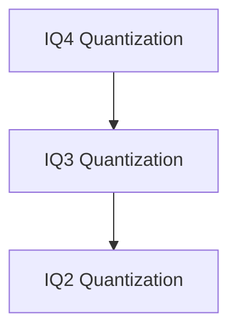

# Quantization Functions Module

## Introduction

The `quantization_functions` module provides a collection of reference quantization functions used within the GGML library. These functions are critical for reducing the precision of floating-point numbers to lower bit-width integer formats (e.g., IQ2, IQ3, IQ4) to optimize memory usage and computational performance of machine learning models. This module specifically offers reference implementations that can be used for verification or in environments where highly optimized, architecture-specific kernels are not available.

## Architecture Overview

The `quantization_functions` module is structured around different integer quantization (IQ) formats, with each sub-module handling the specific logic for quantizing rows of data into its target format. These sub-modules depend on core GGML utilities for basic quantization operations and assertions.

<!-- DIAGRAM_JSON
{
    "direction": "TD",
    "nodes": [
        {"id": "iq2_quantization", "label": "IQ2 Quantization", "type": "module", "link": "iq2_quantization.md"},
        {"id": "iq3_quantization", "label": "IQ3 Quantization", "type": "module", "link": "iq3_quantization.md"},
        {"id": "iq4_quantization", "label": "IQ4 Quantization", "type": "module", "link": "iq4_quantization.md"}
    ],
    "edges": [
        {"source": "iq3_quantization", "target": "iq2_quantization"},
        {"source": "iq4_quantization", "target": "iq3_quantization"}
    ],
    "groups": []
}
-->

## Sub-modules

### [IQ2 Quantization](iq2_quantization.md)
This sub-module focuses on quantizing rows of floating-point data into the IQ2_s integer format. It includes reference implementations for IQ2_s quantization.

### [IQ3 Quantization](iq3_quantization.md)
This sub-module provides reference implementations for quantizing rows into IQ3_s and IQ3_xxs integer formats, which are designed for different levels of precision and compression.

### [IQ4 Quantization](iq4_quantization.md)
This sub-module handles the reference quantization of floating-point rows into the IQ4_xs integer format, offering a balance between precision and efficiency.