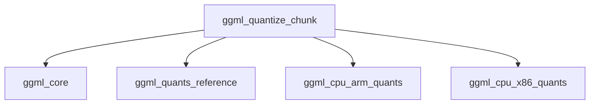

# Module: quantization_processing

## Introduction
The `quantization_processing` module is a critical component within the `ggml` ecosystem, responsible for the efficient quantization of floating-point data (typically `float32`) into various lower-precision GGML tensor types. This process is fundamental for reducing memory footprint and accelerating computations in machine learning models, especially during inference.

The module's core functionality is encapsulated in the `ggml_quantize_chunk` function, which acts as a dispatcher, selecting and executing the appropriate quantization algorithm based on the target `ggml_type`. It supports a wide array of quantization schemes, including various `Q4`, `Q5`, `Q8`, `Q2_K`, `Q3_K`, `Q4_K`, `Q5_K`, `Q6_K`, `TQ1_0`, `TQ2_0`, `IQ1_S`, `IQ1_M`, `IQ2_XXS`, `IQ2_XS`, `IQ2_S`, `IQ3_XXS`, `IQ3_S`, `IQ4_NL`, `IQ4_XS` types, as well as direct conversion to `F16`, `BF16`, and `F32`.

## Architecture and Component Relationships

The `quantization_processing` module primarily contains the `ggml_quantize_chunk` function, which orchestrates the quantization process. This function depends on utility functions from the `ggml_core` module and delegates the actual quantization logic to specialized functions (e.g., `quantize_q4_0`, `quantize_q5_0`) that are often implemented in architecture-specific quantization modules like `ggml_cpu_arm_quants` and `ggml_cpu_x86_quants`, or general reference implementations in `ggml_quants_reference`.

<!-- DIAGRAM_JSON
{
    "direction": "TD",
    "nodes": [
        {"id": "ggml_quantize_chunk", "label": "ggml_quantize_chunk", "type": "component", "link": null},
        {"id": "ggml_core", "label": "ggml_core", "type": "external", "link": "ggml_core.md"},
        {"id": "ggml_quants_reference", "label": "ggml_quants_reference", "type": "external", "link": "ggml_quants_reference.md"},
        {"id": "ggml_cpu_arm_quants", "label": "ggml_cpu_arm_quants", "type": "external", "link": "ggml_cpu_arm_quants.md"},
        {"id": "ggml_cpu_x86_quants", "label": "ggml_cpu_x86_quants", "type": "external", "link": "ggml_cpu_x86_quants.md"}
    ],
    "edges": [
        {"source": "ggml_quantize_chunk", "target": "ggml_core"},
        {"source": "ggml_quantize_chunk", "target": "ggml_quants_reference"},
        {"source": "ggml_quantize_chunk", "target": "ggml_cpu_arm_quants"},
        {"source": "ggml_quantize_chunk", "target": "ggml_cpu_x86_quants"}
    ],
    "groups": []
}
-->



### Core Functionality

The `ggml_quantize_chunk` function serves as the central API for performing quantization:

```c
size_t ggml_quantize_chunk(
        enum ggml_type   type,
           const float * src,
                  void * dst,
               int64_t   start,
               int64_t   nrows,
               int64_t   n_per_row,
           const float * imatrix) {
    // ... implementation details ...
}
```

**Parameters:**
*   `type`: The target `ggml_type` enum specifying the quantization format (e.g., `GGML_TYPE_Q4_0`, `GGML_TYPE_Q8_0`).
*   `src`: Pointer to the source floating-point data (`float32`).
*   `dst`: Pointer to the destination buffer where the quantized data will be stored.
*   `start`: Starting offset in the `src` array.
*   `nrows`: Number of rows to quantize.
*   `n_per_row`: Number of elements per row.
*   `imatrix`: Optional importance matrix, used by certain quantization types (e.g., K-quantizations) to improve quantization quality.

**Process Flow:**
1.  **Initialization:** Calls `ggml_quantize_init(type)` to ensure the quantization environment is set up (this is typically a no-op if already initialized).
2.  **Input Validation:** Asserts that `imatrix` is provided if the `type` requires it, and that `start` is correctly aligned with `blck_size` and `n_per_row`.
3.  **Type Dispatch:** Uses a `switch` statement to dispatch to the specific quantization function corresponding to the `ggml_type`. These functions (`quantize_q4_0`, `quantize_q5_0`, etc.) handle the actual bit packing and data compression.
4.  **Special Handling:** For `GGML_TYPE_F16`, `GGML_TYPE_BF16`, and `GGML_TYPE_F32`, it performs direct type conversion or memory copy instead of a quantization algorithm.
5.  **Result:** Returns the size in bytes of the quantized data written to the `dst` buffer.

## Integration with the Overall System

The `quantization_processing` module is a sub-module of `ggml_quantization`, which in turn is part of the broader `ggml_core` library. It provides the essential capability for converting full-precision model weights and activations into smaller, more efficient quantized formats. This is crucial for:

*   **Model Size Reduction:** Significantly decreases the disk and memory footprint of large language models.
*   **Performance Optimization:** Enables faster computation, especially on hardware with limited memory bandwidth or specialized integer/low-precision arithmetic units.

This module acts as a bridge between the high-level `ggml` tensor operations (defined in [ggml_core.md](ggml_core.md)) and the low-level, often architecture-optimized, quantization kernel implementations found in modules like [ggml_quants_reference.md](ggml_quants_reference.md), [ggml_cpu_arm_quants.md](ggml_cpu_arm_quants.md), and [ggml_cpu_x86_quants.md](ggml_cpu_x86_quants.md). It ensures that `ggml` applications can seamlessly utilize various quantization schemes by providing a unified entry point.
