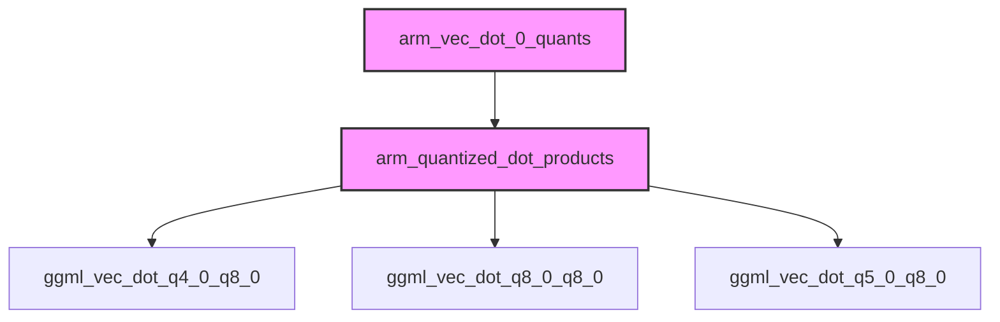

# quantized_dot_product_kernels Module Documentation

## Introduction
The `quantized_dot_product_kernels` module is a critical component within the GGML library, specifically designed to provide highly optimized vector dot product implementations for various quantized tensor types on ARM-based CPUs. These kernels are essential for accelerating the inference of machine learning models that leverage GGML's quantization features, ensuring efficient computation by utilizing ARM NEON and SVE intrinsics.

## Core Functionality and Components

This module contains specialized C functions for performing dot products between different quantized data types, primarily focusing on `q4_0`, `q5_0`, and `q8_0` quantized blocks with `q8_0` quantized blocks. The core components are:

*   **`ggml_vec_dot_q4_0_q8_0`**: Performs a dot product between `q4_0` quantized blocks and `q8_0` quantized blocks. This function is heavily optimized using ARM NEON and SVE (Scalable Vector Extension) instructions to maximize throughput for 4-bit and 8-bit integer operations.
*   **`ggml_vec_dot_q8_0_q8_0`**: Implements the dot product operation between two `q8_0` quantized blocks. Similar to the `q4_0_q8_0` kernel, it utilizes ARM NEON and SVE for significant performance gains.
*   **`ggml_vec_dot_q5_0_q8_0`**: Handles the dot product computation between `q5_0` quantized blocks and `q8_0` quantized blocks. This kernel also benefits from ARM NEON optimizations, including specialized handling for the 5-bit quantization scheme.

These functions abstract away the complexities of low-level ARM assembly and intrinsic programming, providing a high-performance interface for common quantized linear algebra operations.

## Architecture and Component Relationships

The `quantized_dot_product_kernels` module is a leaf module within the broader `ggml_cpu_arm_quants` hierarchy. It directly implements the fundamental vector dot product kernels that are invoked by higher-level quantization routines.

<!-- DIAGRAM_JSON
{
    "direction": "TD",
    "nodes": [
        {"id": "q4_0_q8_0_kernel", "label": "ggml_vec_dot_q4_0_q8_0", "type": "component", "link": null},
        {"id": "q8_0_q8_0_kernel", "label": "ggml_vec_dot_q8_0_q8_0", "type": "component", "link": null},
        {"id": "q5_0_q8_0_kernel", "label": "ggml_vec_dot_q5_0_q8_0", "type": "component", "link": null},
        {"id": "arm_quant_dot_products", "label": "arm_quantized_dot_products", "type": "external", "link": "arm_quantized_dot_products.md"},
        {"id": "arm_vec_dot_0_quants", "label": "arm_vec_dot_0_quants", "type": "external", "link": "arm_vec_dot_0_quants.md"}
    ],
    "edges": [
        {"source": "arm_quant_dot_products", "target": "q4_0_q8_0_kernel"},
        {"source": "arm_quant_dot_products", "target": "q8_0_q8_0_kernel"},
        {"source": "arm_quant_dot_products", "target": "q5_0_q8_0_kernel"},
        {"source": "arm_vec_dot_0_quants", "target": "arm_quant_dot_products"}
    ],
    "groups": []
}
-->

### Integration with the Overall System
This module is a low-level optimization layer for ARM CPUs within the [ggml_cpu_arm_quants](ggml_cpu_arm_quants.md) module. It provides the fundamental building blocks for efficient execution of quantized neural network operations. Any higher-level operations in the GGML library that require dot products between quantized tensors on ARM platforms will ultimately rely on the kernels defined here. Its primary role is to ensure that tensor computations are performed with maximum efficiency, directly impacting the inference speed and power consumption of AI models running on ARM devices.