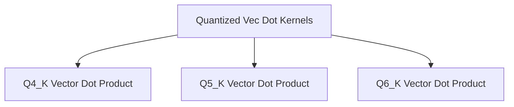

# Quantized Vector Dot Kernels

## Introduction
This module (`quantized_vec_dot_kernels`) provides highly optimized vector dot product kernels specifically designed for quantized tensors (Q4_K, Q5_K, and Q6_K) on ARM-based CPUs. These kernels leverage ARM's Single Vector Extensions (SVE) and NEON instruction sets to maximize performance for machine learning inference tasks, particularly within the GGML library context.

The primary purpose of this module is to enable efficient computation with quantized weight matrices and activation vectors, which is crucial for reducing memory footprint and accelerating inference speed in large language models and other neural networks.

## Architecture Overview
The `quantized_vec_dot_kernels` module is a part of the `ggml_cpu_arm_quants` sub-module within the broader GGML (Georgi Gerganov's Machine Learning) library. It specifically targets ARM architectures, providing specialized implementations that bypass generic CPU paths when SVE or NEON features are available. Each kernel is tailored to a specific quantization type (Q4_K, Q5_K, Q6_K) to ensure optimal performance and accuracy.

### Module Relationships
This module relies on underlying ARM CPU features and GGML's common quantization block structures (`block_q4_K`, `block_q5_K`, `block_q6_K`, `block_q8_K`). It acts as a performance-critical component for layers involving matrix multiplications with quantized weights.

<!-- DIAGRAM_JSON
{
    "direction": "TD",
    "nodes": [
        {"id": "q4_vec_dot_kernel", "label": "Q4_K Vector Dot Product", "type": "module", "link": "q4_vec_dot_kernel.md"},
        {"id": "q5_vec_dot_kernel", "label": "Q5_K Vector Dot Product", "type": "module", "link": "q5_vec_dot_kernel.md"},
        {"id": "q6_vec_dot_kernel", "label": "Q6_K Vector Dot Product", "type": "module", "link": "q6_vec_dot_kernel.md"}
    ],
    "edges": [
        {"source": "quantized_vec_dot_kernels", "target": "q4_vec_dot_kernel"},
        {"source": "quantized_vec_dot_kernels", "target": "q5_vec_dot_kernel"},
        {"source": "quantized_vec_dot_kernels", "target": "q6_vec_dot_kernel"}
    ],
    "groups": []
}
-->

## Sub-modules

### [Q4_K Vector Dot Product](q4_vec_dot_kernel.md)
This sub-module contains the implementation for the vector dot product operation involving Q4_K quantized input tensors. It utilizes ARM SVE and NEON intrinsics for highly efficient computations.

### [Q5_K Vector Dot Product](q5_vec_dot_kernel.md)
This sub-module provides the vector dot product implementation tailored for Q5_K quantized input tensors. It is optimized for ARM NEON architectures to deliver fast performance.

### [Q6_K Vector Dot Product](q6_vec_dot_kernel.md)
This sub-module offers the vector dot product implementation for Q6_K quantized input tensors, leveraging ARM SVE and NEON instruction sets for accelerated processing.
