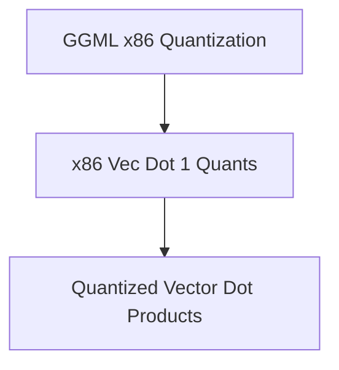

# Quantized Vector Dot Products Module

## Introduction

The `quantized_vector_dot_products` module is a critical component within the GGML library, specifically targeting optimized vector dot product computations for quantized data types on x86 architectures. This module provides highly efficient implementations for `q4_1` with `q8_1` and `q5_1` with `q8_1` quantized vector dot products, leveraging AVX/AVX2 CPU intrinsics to maximize performance. It plays a vital role in accelerating neural network inference by performing low-precision arithmetic operations, which are essential for memory and computational efficiency.

## Architecture

This module resides within the `ggml_cpu_x86_quants` hierarchy, specifically as a sub-module of `x86_vec_dot_1_quants`. It directly interfaces with the CPU's instruction set for vector operations, bypassing higher-level abstractions for raw performance. Its functions are designed to work with GGML's custom block quantization formats, handling the decompression and multiplication of quantized values to produce a single-precision floating-point sum.

<!-- DIAGRAM_JSON
{
    "direction": "TD",
    "nodes": [
        {"id": "ggml_cpu_x86_quants", "label": "GGML x86 Quantization", "type": "module", "link": "ggml_cpu_x86_quants.md"},
        {"id": "x86_vec_dot_1_quants", "label": "x86 Vec Dot 1 Quants", "type": "module", "link": "x86_vec_dot_1_quants.md"},
        {"id": "quantized_vector_dot_products", "label": "Quantized Vector Dot Products", "type": "module", "link": "quantized_vector_dot_products.md"}
    ],
    "edges": [
        {"source": "ggml_cpu_x86_quants", "target": "x86_vec_dot_1_quants"},
        {"source": "x86_vec_dot_1_quants", "target": "quantized_vector_dot_products"}
    ],
    "groups": []
}
-->

## Core Functionality

This module implements highly optimized vector dot product functions for specific quantized data types.

### `ggml_vec_dot_q5_1_q8_1`
This function computes the dot product of a `q5_1` quantized vector `x` with a `q8_1` quantized vector `y`. It is optimized for x86 CPUs using AVX2 or AVX intrinsics. The function handles the extraction of nibbles and bits from the quantized blocks, performs element-wise multiplication, and accumulates the results, including scale and offset contributions, into a single float sum. This function is crucial for efficient computations involving models quantized to these specific formats.

### `ggml_vec_dot_q4_1_q8_1`
Similar to `ggml_vec_dot_q5_1_q8_1`, this function calculates the dot product between a `q4_1` quantized vector `x` and a `q8_1` quantized vector `y`. It also utilizes AVX2 or AVX intrinsics for accelerated execution on x86 processors. The core logic involves unpacking the 4-bit and 8-bit quantized values, multiplying them, and summing the results, incorporating their respective scales to maintain precision. This provides a performance-critical path for models using `q4_1` quantization.
