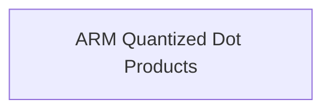

# `quantized_vector_dot_products_arm` Module Documentation

## Introduction

The `quantized_vector_dot_products_arm` module provides highly optimized implementations of vector dot product operations specifically tailored for ARM architecture. These operations are crucial for efficient execution of quantized neural network models on ARM-based devices, by leveraging ARM's specific architectural features for performance.

## Architecture

This module is a part of the `ggml_cpu_arm_quants` module, focusing on specific quantized vector dot product functions. It integrates with the broader GGML (Georgi Gerganov's Machine Learning) ecosystem, contributing low-level, high-performance computational primitives. The core functionality involves multiplying quantized vectors (e.g., Q4_1 and Q8_1, or Q5_1 and Q8_1) to produce a floating-point scalar result.

<!-- DIAGRAM_JSON
{
    "direction": "TD",
    "nodes": [
        {"id": "arm_quantized_dot_products", "label": "ARM Quantized Dot Products", "type": "module", "link": "arm_quantized_dot_products.md"}
    ],
    "edges": [],
    "groups": []
}
-->

## Sub-modules

### [ARM Quantized Dot Products](arm_quantized_dot_products.md)

This sub-module encapsulates the core vector dot product implementations, including `ggml_vec_dot_q4_1_q8_1` and `ggml_vec_dot_q5_1_q8_1`. These functions are optimized for specific quantization formats (Q4_1, Q5_1, Q8_1) and leverage ARM NEON and optional ARMv8.2-A (Matrix Multiply-Accumulate) extensions for maximum performance.
