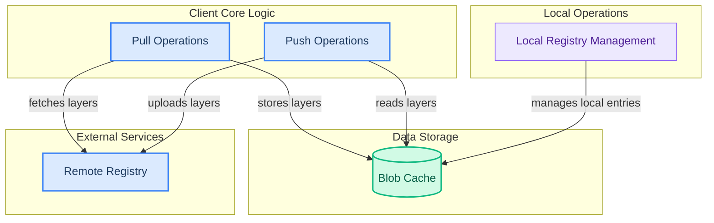

# Registry Client Operations

This module orchestrates client-side interactions with the model registry, handling both pulling model layers and manifests from remote sources and pushing local model changes to the registry.

<!-- DIAGRAM_JSON
{
    "direction": "TD",
    "nodes": [
        {"id": "pull_operations", "label": "Pull Operations", "type": "module", "link": "pull_operations.md"},
        {"id": "push_operations", "label": "Push Operations", "type": "module", "link": "push_operations.md"},
        {"id": "local_registry_management", "label": "Local Registry Management", "type": "module", "link": "local_registry_management.md"},
        {"id": "blob_cache", "label": "Blob Cache", "type": "external", "link": "blob_cache_management.md"},
        {"id": "remote_registry", "label": "Remote Registry", "type": "external"}
    ],
    "edges": [
        {"source": "pull_operations", "target": "remote_registry", "label": "fetches layers"},
        {"source": "pull_operations", "target": "blob_cache", "label": "stores layers"},
        {"source": "push_operations", "target": "blob_cache", "label": "reads layers"},
        {"source": "push_operations", "target": "remote_registry", "label": "uploads layers"},
        {"source": "local_registry_management", "target": "blob_cache", "label": "manages local entries"}
    ],
    "groups": [
        {"id": "client_core", "label": "Client Core Logic", "role": "surface", "nodes": ["pull_operations", "push_operations"]},
        {"id": "local_ops", "label": "Local Operations", "role": "analytical", "nodes": ["local_registry_management"]},
        {"id": "data_store", "label": "Data Storage", "role": "data", "nodes": ["blob_cache"]},
        {"id": "external_services", "label": "External Services", "role": "external", "nodes": ["remote_registry"]}
    ]
}
-->
