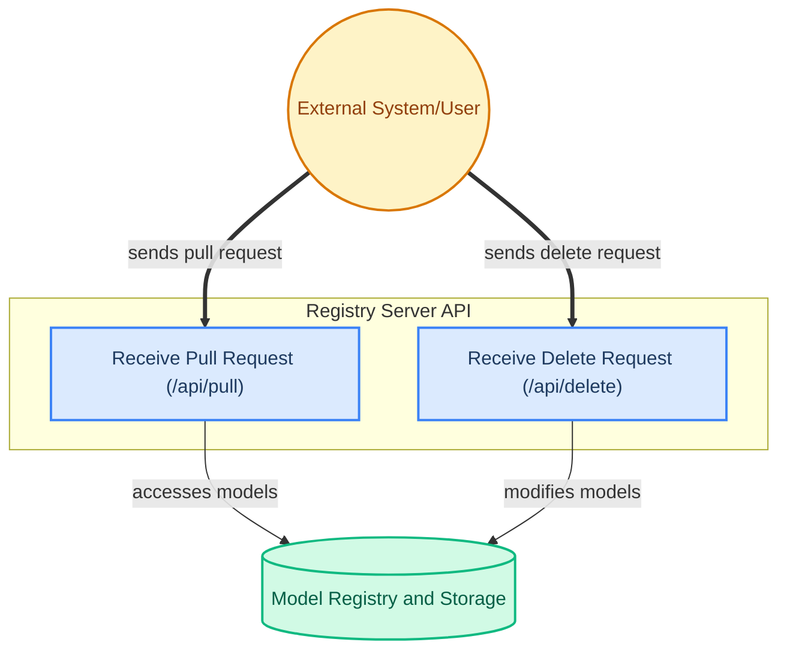

# Registry Server Endpoints

This module defines and tests the HTTP API endpoints that enable external clients and systems to interact with the model registry server. It handles requests for pulling and deleting model artifacts, including input validation and error handling.

<!-- DIAGRAM_JSON
{
    "direction": "TD",
    "nodes": [
        {"id": "client", "label": "External System/User", "type": "external", "link": null},
        {"id": "pull_request", "label": "Receive Pull Request (\"/api/pull\")", "type": "component", "link": null},
        {"id": "delete_request", "label": "Receive Delete Request (\"/api/delete\")", "type": "component", "link": null},
        {"id": "model_storage", "label": "Model Registry and Storage", "type": "external", "link": "model_registry_and_storage.md"}
    ],
    "edges": [
        {"source": "client", "target": "pull_request", "label": "sends pull request"},
        {"source": "client", "target": "delete_request", "label": "sends delete request"},
        {"source": "pull_request", "target": "model_storage", "label": "accesses models"},
        {"source": "delete_request", "target": "model_storage", "label": "modifies models"}
    ],
    "groups": [
        {"id": "api_endpoints", "label": "Registry Server API", "role": "surface", "nodes": ["pull_request", "delete_request"]}
    ]
}
-->
