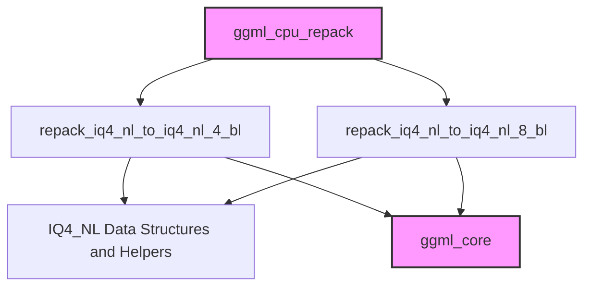

# repacking_operations Module Documentation

The `repacking_operations` module is a crucial component within the `ggml_cpu_repack` sub-system, specifically designed for optimizing the memory layout of quantized tensors on the CPU. It focuses on re-organizing `IQ4_NL` type tensors into interleaved block formats, which can significantly enhance performance for subsequent computation by improving data locality and cache utilization.

### Purpose and Core Functionality

The primary purpose of this module is to perform specialized repacking operations for `IQ4_NL` (4-bit integer, non-linear) quantized tensors. This involves transforming the data from a standard block-wise storage into an interleaved block format, preparing it for efficient processing by various CPU kernels. The core functionality is implemented through two main repacking functions:

*   **`repack_iq4_nl_to_iq4_nl_4_bl`**: This function repacks `IQ4_NL` tensors into a format where 4 blocks are interleaved. It's designed to optimize data access for operations that benefit from this specific interleaving pattern.
*   **`repack_iq4_nl_to_iq4_nl_8_bl`**: Similar to the 4-block repacker, this function handles `IQ4_NL` tensors but interleaves them in blocks of 8. This provides flexibility to cater to different architectural optimizations or specific computational requirements.

Both functions ensure data integrity through assertions on the tensor type (`GGML_TYPE_IQ4_NL`) and the interleave block size. They also include validation steps to check for compatible tensor dimensions before proceeding with the repacking.

### Architecture and Component Relationships

The `repacking_operations` module is a leaf module nestled under `ggml_cpu_repack`, `q2_iq4_repacking`, and `iq4_nl_repacking`. Its functions directly manipulate `ggml_tensor` structures and utilize specific `IQ4_NL` block definitions and helper functions for their operations.

<!-- DIAGRAM_JSON
{
    "direction": "TD",
    "nodes": [
        {"id": "repack_4_bl", "label": "repack_iq4_nl_to_iq4_nl_4_bl", "type": "component", "link": null},
        {"id": "repack_8_bl", "label": "repack_iq4_nl_to_iq4_nl_8_bl", "type": "component", "link": null},
        {"id": "iq4_nl_helpers", "label": "IQ4_NL Data Structures and Helpers", "type": "component", "link": null},
        {"id": "ggml_cpu_repack_module", "label": "ggml_cpu_repack", "type": "external", "link": "ggml_cpu_repack.md"},
        {"id": "ggml_core_module", "label": "ggml_core", "type": "external", "link": "ggml_core.md"}
    ],
    "edges": [
        {"source": "repack_4_bl", "target": "iq4_nl_helpers"},
        {"source": "repack_8_bl", "target": "iq4_nl_helpers"},
        {"source": "repack_4_bl", "target": "ggml_core_module"},
        {"source": "repack_8_bl", "target": "ggml_core_module"},
        {"source": "ggml_cpu_repack_module", "target": "repack_4_bl"},
        {"source": "ggml_cpu_repack_module", "target": "repack_8_bl"}
    ],
    "groups": []
}
-->

### How the Module Fits into the Overall System

The `repacking_operations` module is an integral part of the GGML CPU backend's quantization and optimization pipeline. Its functions are called by higher-level modules within [ggml_cpu_repack](ggml_cpu_repack.md) to prepare `IQ4_NL` quantized tensor data. This preparation is critical before these tensors are passed to specialized CPU kernels (e.g., those found in [ggml_cpu_x86_quants](ggml_cpu_x86_quants.md) or [ggml_cpu_arm_quants](ggml_cpu_arm_quants.md)) for actual computation. By ensuring the data is laid out optimally in memory, this module contributes directly to the overall performance and efficiency of quantized model inference on CPU architectures. It relies on fundamental data types and utility functions provided by the [ggml_core](ggml_core.md) module.