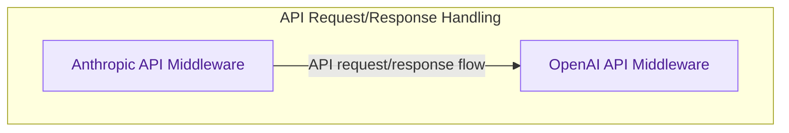

# Request Middleware
This module provides an abstraction layer for handling incoming API requests and transforming outgoing responses, supporting various models and API specifications like Anthropic and OpenAI.

<!-- DIAGRAM_JSON
{
    "direction": "TD",
    "nodes": [
        {"id": "anthropic_api_middleware", "label": "Anthropic API Middleware", "type": "module", "link": "anthropic_api_middleware.md"},
        {"id": "openai_api_middleware", "label": "OpenAI API Middleware", "type": "module", "link": "openai_api_middleware.md"}
    ],
    "edges": [
        {"source": "anthropic_api_middleware", "target": "openai_api_middleware", "label": "API request/response flow"}
    ],
    "groups": [
        {"id": "api_handling", "label": "API Request/Response Handling", "role": "analytical", "nodes": ["anthropic_api_middleware", "openai_api_middleware"]}
    ]
}
-->
