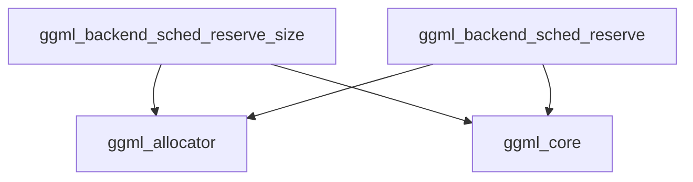

# Resource Allocation Module

The `resource_allocation` module, a sub-component of `graph_resource_management` within the `ggml_backend_core` module, is responsible for managing the reservation and allocation of computational resources, primarily memory, for GGML computation graphs. It provides core functionalities for calculating required memory sizes and subsequently reserving those resources across various backend splits.

## Architecture and Core Components

The `resource_allocation` module consists of two primary functions that handle the reservation and allocation process:

### `ggml_backend_sched_reserve_size`
This function calculates and reserves the necessary memory size for a given computation graph. It takes into account all nodes and leaf nodes within the graph to determine the total memory requirement. It utilizes scheduler utilities to prepare the graph for allocation and then queries the generic allocator for the required sizes.

### `ggml_backend_sched_reserve`
This function attempts to reserve and allocate the computed resources for a computation graph. It orchestrates the allocation process across different backend splits, ensuring that each backend has the necessary resources. If a backend has a specific `graph_reserve` implementation, it is called to handle the allocation on that particular backend.

## Module Relationships

The `resource_allocation` module plays a critical role in the `ggml_backend_core` by ensuring that computation graphs have the necessary resources before execution. It interacts closely with:

*   **[ggml_allocator](ggml_allocator.md)**: For the actual memory allocation and reservation operations.
*   **[ggml_core](ggml_core.md)**: To understand and process the structure of computation graphs (`ggml_cgraph`).
*   **backend_scheduling**: (Implicitly, as it operates on `ggml_backend_sched_t` which is central to the scheduling mechanism) The functions within this module manage the allocation process based on the scheduler's state and graph splits.

<!-- DIAGRAM_JSON
{
    "direction": "TD",
    "nodes": [
        {"id": "reserve_size", "label": "ggml_backend_sched_reserve_size", "type": "component", "link": null},
        {"id": "reserve", "label": "ggml_backend_sched_reserve", "type": "component", "link": null},
        {"id": "ggml_allocator", "label": "ggml_allocator", "type": "external", "link": "ggml_allocator.md"},
        {"id": "ggml_core", "label": "ggml_core", "type": "external", "link": "ggml_core.md"}
    ],
    "edges": [
        {"source": "reserve_size", "target": "ggml_allocator"},
        {"source": "reserve_size", "target": "ggml_core"},
        {"source": "reserve", "target": "ggml_allocator"},
        {"source": "reserve", "target": "ggml_core"}
    ],
    "groups": []
}
-->

