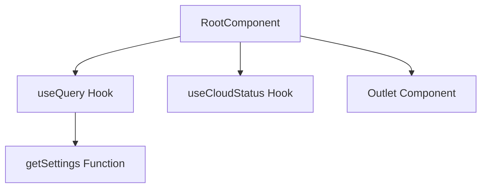

# root_ui_component

## Introduction
The `root_ui_component` module defines the `RootComponent`, which serves as the top-level UI component for the application. It is responsible for initializing core application data, such as settings and cloud status, and setting up the main routing outlet for the entire user interface.

## Purpose and Core Functionality
The primary purpose of the `RootComponent` is to establish the foundational structure of the application's user interface. Its core functionalities include:
- **Initial Data Fetching**: On application startup, it initiates requests to fetch global settings and the current cloud status. This ensures that essential configurations and operational states are available throughout the application.
- **Routing Integration**: It acts as the primary layout component, rendering the content of the currently active route via the `<Outlet />` component, provided by the routing library. This positions it as the entry point for the application's view hierarchy.

## Architecture and Component Relationships

<!-- DIAGRAM_JSON
{
    "direction": "TD",
    "nodes": [
        {"id": "root_component", "label": "RootComponent", "type": "component", "link": null},
        {"id": "use_query", "label": "useQuery Hook", "type": "external", "link": null},
        {"id": "get_settings", "label": "getSettings Function", "type": "external", "link": "app_ui_api_client.md"},
        {"id": "use_cloud_status", "label": "useCloudStatus Hook", "type": "external", "link": "app_ui_hooks.md"},
        {"id": "outlet", "label": "Outlet Component", "type": "external", "link": "app_ui_routing.md"}
    ],
    "edges": [
        {"source": "root_component", "target": "use_query"},
        {"source": "use_query", "target": "get_settings"},
        {"source": "root_component", "target": "use_cloud_status"},
        {"source": "root_component", "target": "outlet"}
    ],
    "groups": []
}
-->

## Component Breakdown

### `RootComponent` (`app.ui.app.src.routes.__root.RootComponent`)
This is a React functional component that orchestrates the initial loading of application-wide data and manages the primary routing outlet.

-   **`useQuery({ queryKey: ["settings"], queryFn: getSettings })`**: This hook is used to fetch application settings when the component mounts. It ensures that critical configuration data is available from the outset. The `getSettings` function is responsible for the actual data retrieval, likely interacting with an API. For more details, refer to the [app_ui_api_client documentation](app_ui_api_client.md).
-   **`useCloudStatus()`**: This custom hook is invoked to fetch and manage the application's cloud status. It provides real-time or near real-time information about the cloud service's state, which might influence various UI elements or functionalities. Further details can be found in the [app_ui_hooks documentation](app_ui_hooks.md).
-   **`<Outlet />`**: This component, typically provided by a routing library like React Router, acts as a placeholder where child route components will be rendered. By including it in the `RootComponent`, it ensures that all application routes are displayed within this root layout. More information on routing can be found in the [app_ui_routing documentation](app_ui_routing.md).

## How it Fits into the Overall System
The `root_ui_component` module, specifically the `RootComponent`, is fundamental to the application's frontend architecture. It serves as the initial entry point for the UI after the application loads, providing a consistent layout and ensuring that essential global data (settings, cloud status) is loaded before or alongside the rendering of specific routes. It integrates directly with the routing system, defining where the content of nested routes will appear. This central role makes it a critical component for application initialization and overall user experience.