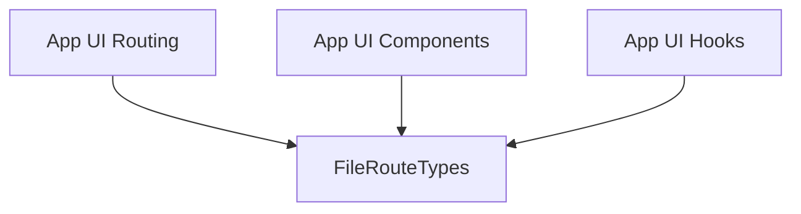

# `route_definitions` Module Documentation

## Introduction

The `route_definitions` module is a crucial part of the application's user interface routing system. It is responsible for defining the complete set of client-side routes and providing type-safe definitions for accessing route-related information. This module ensures consistency and reliability across the application's navigation, serving as the single source of truth for UI route configurations.

## Architecture and Component Relationships

The `route_definitions` module primarily consists of generated TypeScript type definitions that enumerate all possible application routes and their associated metadata. The core component, `app.ui.app.src.routeTree.gen.FileRouteTypes`, encapsulates this information, making it readily available and type-checkable throughout the UI codebase.

The module is a sub-module of `app_ui_routing` and plays a foundational role in enabling client-side navigation. Other UI-related modules, such as `app_ui_components` and `app_ui_hooks`, directly leverage these definitions to render appropriate content, manage application state, and implement navigation logic based on the current URL.

<!-- DIAGRAM_JSON
{
    "direction": "TD",
    "nodes": [
        {"id": "file_route_types", "label": "FileRouteTypes", "type": "component", "link": null},
        {"id": "app_ui_routing", "label": "App UI Routing", "type": "external", "link": "app_ui_routing.md"},
        {"id": "app_ui_components", "label": "App UI Components", "type": "external", "link": "app_ui_components.md"},
        {"id": "app_ui_hooks", "label": "App UI Hooks", "type": "external", "link": "app_ui_hooks.md"}
    ],
    "edges": [
        {"source": "app_ui_routing", "target": "file_route_types"},
        {"source": "app_ui_components", "target": "file_route_types"},
        {"source": "app_ui_hooks", "target": "file_route_types"}
    ],
    "groups": []
}
-->

### Core Components

#### `app.ui.app.src.routeTree.gen.FileRouteTypes`
(File: `app/ui/app/src/routeTree.gen.ts`)

The `FileRouteTypes` interface defines the structure for all routing-related type definitions. It provides a comprehensive mapping of full paths, navigation targets (`to`), and unique route identifiers (`id`) to their corresponding route information. This interface is automatically generated, ensuring that the route definitions are always up-to-date with the actual file-based routing structure of the application.

Key properties include:
- `fileRoutesByFullPath`: A mapping from full route paths (e.g., `/`, `/settings`, `/c/$chatId`) to their associated route objects.
- `fullPaths`: A union type listing all defined full route paths.
- `fileRoutesByTo`: A mapping from navigation `to` properties (which often mirror full paths) to route objects.
- `to`: A union type listing all possible navigation `to` targets.
- `id`: A union type listing unique identifiers for each route, including a special `__root__` ID.
- `fileRoutesById`: A mapping from route IDs to their associated route objects.

This component is fundamental for enabling type-safe navigation and ensuring that all parts of the UI interact with routes in a consistent and predictable manner.

## How the Module Fits into the Overall System

The `route_definitions` module is an integral part of the `app_ui_routing` system, which orchestrates all client-side navigation within the application's user interface. By providing a centralized and type-safe definition of routes, it underpins several critical functionalities:

1.  **Type-Safe Navigation**: It allows developers to refer to routes by their defined paths or IDs with strong type checking, preventing common errors related to incorrect route strings.
2.  **UI Component Rendering**: Components within `app_ui_components` use these definitions to understand which content to render based on the active route.
3.  **Hooks and Logic**: Custom hooks in `app_ui_hooks` and other business logic can leverage these definitions to programmatically navigate, extract route parameters, and react to route changes.
4.  **Maintainability**: As routes are automatically generated and typed, maintaining and refactoring the application's navigation structure becomes significantly easier and less error-prone.

Essentially, `route_definitions` acts as the blueprint for the application's navigability, ensuring that the UI remains consistent and robust as the application evolves.