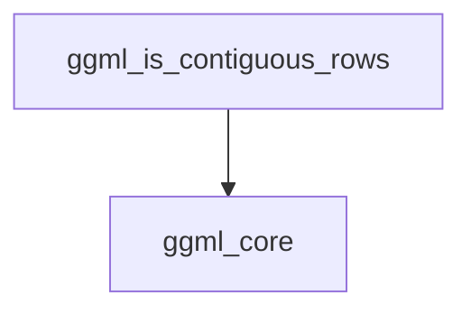

# row_contiguity_checks Module Documentation

## Introduction

The `row_contiguity_checks` module is a low-level component within the GGML machine learning library, specifically responsible for verifying the row contiguity of tensor data structures. This module plays a critical role in ensuring efficient memory access patterns and correct data handling during tensor operations.

## Purpose and Core Functionality

The primary purpose of the `row_contiguity_checks` module is to provide a function, `ggml_is_contiguous_rows`, that determines if the rows of a given `ggml_tensor` are stored contiguously in memory. This check is fundamental for optimizing various tensor operations, especially those that benefit from sequential memory access, such as data transfers, computations, and certain quantization schemes.

Contiguous row storage means that the elements of a row are placed next to each other in memory, and typically, subsequent rows also follow immediately after the previous one, without any gaps or interleaved data from other tensors. This property is vital for performance on many hardware architectures.

## Architecture

The `row_contiguity_checks` module contains a single core function, `ggml_is_contiguous_rows`, which depends on fundamental type and block size information provided by the `ggml_core` module.

<!-- DIAGRAM_JSON
{
    "direction": "TD",
    "nodes": [
        {"id": "ggml_is_contiguous_rows", "label": "ggml_is_contiguous_rows", "type": "component", "link": null},
        {"id": "ggml_core", "label": "ggml_core", "type": "external", "link": "ggml_core.md"}
    ],
    "edges": [
        {"source": "ggml_is_contiguous_rows", "target": "ggml_core"}
    ],
    "groups": []
}
-->

### Component Descriptions

*   **`ggml_is_contiguous_rows`**
    *   **Functionality:** This function checks if the rows of a `ggml_tensor` are contiguous in memory. It does this by comparing the tensor's first dimension (`ne[0]`) with the block size of its type (`ggml_blck_size`) or by comparing the first byte stride (`nb[0]`) with the size of its type (`ggml_type_size`).
    *   **Dependencies:** Relies on utility functions from the `ggml_core` module to retrieve type-specific memory layout information.

## Integration with Overall System

This module is a leaf component within the `ggml_core`'s tensor properties sub-system. It is specifically located under `ggml_core` -> `ggml_tensor_properties` -> `tensor_contiguity_checks` -> `dimension_specific_checks`. The checks provided by `row_contiguity_checks` are consumed by higher-level operations and modules within GGML that require knowledge of a tensor's memory layout for correctness and performance.

For example, functions that perform row-wise operations, memory copy routines, or optimizations based on data locality would call `ggml_is_contiguous_rows` to verify assumptions about the tensor's structure. This ensures that memory accesses are aligned and efficient, which is crucial for the performance of neural network inference and training workloads.

Refer to the [ggml_core documentation](ggml_core.md) for more details on the overall GGML architecture and tensor management. Further information on general contiguity checks can be found in the [contiguity_checks documentation](contiguity_checks.md).