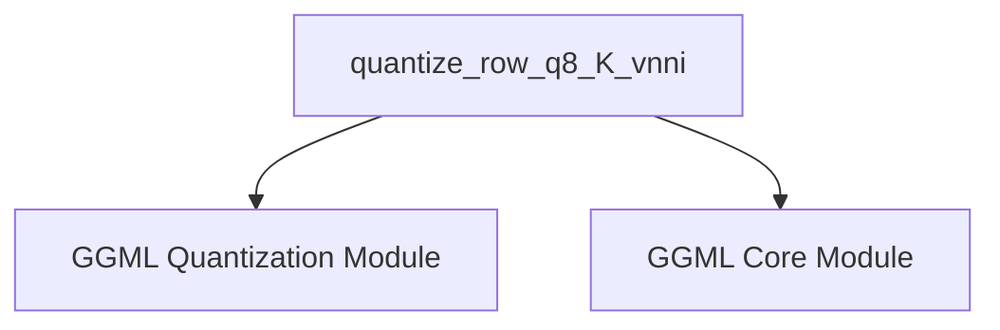

# row_quantization Module Documentation

## Introduction

The `row_quantization` module is a specialized component within the `ggml_cpu_amx` module, dedicated to performing efficient row-wise quantization of floating-point data. Its primary goal is to convert high-precision floating-point numbers into a compact 8-bit quantized format, specifically tailored for Intel's Advanced Matrix Extensions (AMX) with Vector Neural Network Instructions (VNNI) on compatible CPU architectures. This optimization is crucial for reducing the memory footprint of machine learning models and accelerating inference operations.

## Purpose and Core Functionality

The `row_quantization` module provides the essential functionality for transforming rows of 32-bit floating-point numbers into a quantized 8-bit representation, adhering to the `block_q8_K` format. This process is fundamental for enhancing memory efficiency and enabling faster computations in neural network inference. The module leverages the performance benefits of AMX and VNNI instructions to achieve high-throughput block processing, including the precise calculation of scaling factors and block sums.

### `quantize_row_q8_K_vnni`

The core component of this module, `quantize_row_q8_K_vnni`, is responsible for the entire quantization workflow for each block of `QK_K` floats. Its operation can be broken down into the following key steps:

1.  **Maximum Absolute Value Calculation:** For each block, the function efficiently determines the maximum absolute floating-point value using AVX-512 intrinsics (`__m512`, `_mm512_loadu_ps`, `_mm512_max_ps`, `_mm512_reduce_max_ps`). This value is critical for establishing the optimal dynamic range for quantization.
2.  **Scaling Factor Determination:** An inverse scaling factor (`iscale`) is computed based on the maximum absolute value. This factor maps the original floating-point range to the target 8-bit integer range (typically [-127, 127]). The inverse of this scale (`d`) is then converted to half-precision floating-point format and stored.
3.  **Quantization and Rounding:** The original floating-point values are multiplied by the calculated scaling factor and then rounded to the nearest integer. This step converts the continuous float values into discrete integer values.
4.  **Packing into 8-bit Integers:** The 32-bit integer results are subsequently packed into a compact 8-bit integer representation using a series of AVX-512 intrinsics (`__m512i`, `_mm512_cvtepi32_epi8`, `_mm512_cvtps_epi32`, `_mm256_insertf128_si256`, `_mm512_inserti32x8`, `_mm512_storeu_si512`). This packing is crucial for memory efficiency.
5.  **Block Sums Calculation (VNNI):** The module efficiently computes block sums (`bsums`) utilizing VNNI (Vector Neural Network Instructions). This involves transposing packed integer vectors (`transpose_16x4_32bit`) and applying specialized dot product instructions (`_mm512_dpbusd_epi32`) to generate sums that are essential for subsequent dequantization and matrix multiplication operations.

## Architecture and Component Relationships

<!-- DIAGRAM_JSON
{
    "direction": "TD",
    "nodes": [
        {"id": "quantize_row_q8_K_vnni", "label": "quantize_row_q8_K_vnni", "type": "component", "link": null},
        {"id": "ggml_quantization", "label": "GGML Quantization Module", "type": "external", "link": "ggml_quantization.md"},
        {"id": "ggml_core", "label": "GGML Core Module", "type": "external", "link": "ggml_core.md"}
    ],
    "edges": [
        {"source": "quantize_row_q8_K_vnni", "target": "ggml_quantization"},
        {"source": "quantize_row_q8_K_vnni", "target": "ggml_core"}
    ],
    "groups": []
}
-->

### Relationship to Other Modules

-   **Parent Module (`ggml_cpu_amx`):** The `row_quantization` module is a direct sub-module of `ggml_cpu_amx`, signifying its specialized role within the CPU backend that specifically targets Intel AMX-enabled architectures. It operates within the context of other AMX-specific optimizations.
-   **`ggml_quantization`**: This module is a crucial dependency as it is expected to define the `block_q8_K` data structure and fundamental quantization constants, such as `QK_K`, which are directly utilized by `quantize_row_q8_K_vnni`. For a deeper understanding, refer to the [ggml_quantization documentation](ggml_quantization.md).
-   **`ggml_core`**: The `ggml_core` module provides foundational types, essential macros (e.g., `GGML_CPU_FP32_TO_FP16`), and various utility functions that are broadly indispensable across the entire GGML framework, including supporting operations within this quantization module. Further details can be found in the [ggml_core documentation](ggml_core.md).
-   **`packed_format_conversion` (Sibling Module):** It is highly probable that the `packed_format_conversion` module, a sibling within `ggml_cpu_amx`, is responsible for handling the conversion of data to or from the packed 8-bit format generated by `row_quantization`. This ensures interoperability with other operations within the AMX CPU context.

## How the Module Fits into the Overall System

The `row_quantization` module plays a pivotal role in the `ggml` ecosystem by offering a highly optimized and hardware-accelerated quantization routine specifically for Intel AMX-enabled CPUs. Its integration contributes significantly to:

-   **Performance Optimization:** By effectively leveraging AMX and VNNI instructions, this module dramatically accelerates the quantization process, which is often a critical bottleneck in many machine learning inference pipelines.
-   **Memory Efficiency:** The quantization process implemented here substantially reduces the memory footprint required for model weights. This allows for the execution of larger machine learning models or enables more efficient operation on systems with constrained memory resources.
-   **CPU Backend Support:** As a core component of the `ggml_cpu_amx` backend, the `row_quantization` module ensures that `ggml` can fully utilize the advanced architectural features of modern Intel CPUs for highly efficient model execution. This module is thus instrumental in enabling the `ggml` framework to adapt and deliver optimal performance on specific hardware architectures, making it a vital piece within broader machine learning projects like `llama_cpp`.