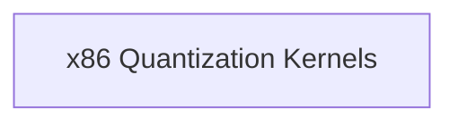

# Row Quantization Functions

This module, `row_quantization_functions`, provides optimized routines for quantizing rows of floating-point numbers into lower-precision integer formats specifically for x86 architectures. These functions are crucial for reducing memory footprint and accelerating computations in machine learning models, particularly within the `ggml` library where efficient CPU operations are paramount.

## Architecture Overview

The `row_quantization_functions` module resides within the `ggml_cpu_x86_quants` hierarchy, specifically under `x86_row_quantization`. It leverages x86-specific CPU instructions, such as AVX/AVX2, to perform highly optimized quantization operations. This module directly contributes to the performance of quantized model inference on x86-based systems.

<!-- DIAGRAM_JSON
{
    "direction": "TD",
    "nodes": [
        {"id": "x86_quantization_kernels", "label": "x86 Quantization Kernels", "type": "module", "link": "x86_quantization_kernels.md"}
    ],
    "edges": [],
    "groups": []
}
-->

## Sub-modules

### [x86 Quantization Kernels](x86_quantization_kernels.md)
This sub-module contains the core x86-specific implementations for various row quantization schemes, including Q8_1 and Q8_K formats. It utilizes advanced vector instructions to achieve high performance. Refer to its dedicated documentation for detailed insights into the specific quantization algorithms and their implementations.