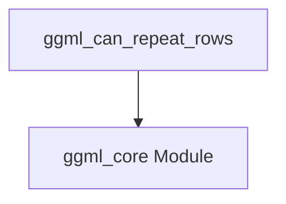

# Module: `row_repeatability`

## Introduction

The `row_repeatability` module, part of `ggml_core`'s tensor properties, provides a specific utility to determine if the rows of two given GGML tensors can be considered "repeatable" in a certain context. This is crucial for optimizing tensor operations, especially in scenarios where broadcasting or row-wise duplication might occur.

## Core Functionality

This module contains the `ggml_can_repeat_rows` function, which serves as the primary mechanism for assessing row repeatability between tensors.

### `ggml_can_repeat_rows`

```c
static inline bool ggml_can_repeat_rows(const struct ggml_tensor * t0, const struct ggml_tensor * t1) {
    static_assert(GGML_MAX_DIMS == 4, "GGML_MAX_DIMS is not 4 - update this function");

    return (t0->ne[0] == t1->ne[0]) && ggml_can_repeat(t0, t1);
}
```

This static inline function checks if two GGML tensors (`t0` and `t1`) can have their rows repeated. The check involves two main conditions:
1.  **Dimension 0 Equality**: It verifies that the size of the first dimension (`ne[0]`) of both tensors is identical. This ensures that the basic row count or size matches.
2.  **General Repeatability**: It delegates to a more general `ggml_can_repeat` function (likely found within the broader `ggml_core` module or its utilities) to perform further checks on tensor repeatability across other dimensions or properties.

The `static_assert` ensures that the `GGML_MAX_DIMS` constant is `4`, indicating that this function's logic is designed for tensors with up to 4 dimensions. If `GGML_MAX_DIMS` changes, this function would need an update.

## Architecture and Component Relationships

The `row_repeatability` module is a leaf module within the `ggml_core` component, specifically under `ggml_tensor_properties`. It relies on core GGML utilities for its functionality.

<!-- DIAGRAM_JSON
{
    "direction": "TD",
    "nodes": [
        {"id": "ggml_can_repeat_rows", "label": "ggml_can_repeat_rows", "type": "component", "link": null},
        {"id": "ggml_core", "label": "ggml_core Module", "type": "external", "link": "ggml_core.md"}
    ],
    "edges": [
        {"source": "ggml_can_repeat_rows", "target": "ggml_core"}
    ],
    "groups": []
}
-->


## How the Module Fits into the Overall System

The `row_repeatability` module is a specialized part of `ggml_core.ggml_tensor_properties.tensor_contiguity_checks`. It provides a low-level utility function critical for internal tensor manipulation and optimization within the GGML library.

Its primary role is to inform higher-level operations, such as tensor broadcasting, memory allocation, or kernel selection, about whether certain row-wise operations can be efficiently performed or if special handling is required due to differing row structures. By centralizing this check, it contributes to the robustness and performance of GGML's tensor computation graph.
