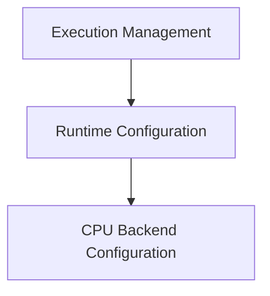

# Runtime Configuration Module

## Introduction

The `runtime_configuration` module is responsible for managing the runtime settings of the GGML CPU backend. It provides essential functions to configure thread management, thread pools, and mechanisms for handling asynchronous abort signals, ensuring efficient and controlled execution of operations.

## Architecture

The `runtime_configuration` module is a crucial part of the [ggml_cpu_backend](ggml_cpu_backend.md)'s [cpu_backend_api](cpu_backend_api.md), specifically within the [execution_management](execution_management.md) sub-module. It encapsulates the core logic for setting up the operational environment for CPU-based computations, interacting directly with the GGML backend context.

<!-- DIAGRAM_JSON
{
    "direction": "TD",
    "nodes": [
        {"id": "execution_management", "label": "Execution Management", "type": "module", "link": "execution_management.md"},
        {"id": "runtime_configuration", "label": "Runtime Configuration", "type": "module", "link": "runtime_configuration.md"},
        {"id": "cpu_backend_configuration", "label": "CPU Backend Configuration", "type": "module", "link": "cpu_backend_configuration.md"}
    ],
    "edges": [
        {"source": "execution_management", "target": "runtime_configuration"},
        {"source": "runtime_configuration", "target": "cpu_backend_configuration"}
    ],
    "groups": []
}
-->

## Sub-modules

### [CPU Backend Configuration](cpu_backend_configuration.md)
This sub-module centralizes the functions for configuring the GGML CPU backend's runtime parameters. It allows developers to specify the number of threads for parallel execution, assign a custom thread pool for managing concurrency, and register an abort callback mechanism to gracefully handle interruptions during operations. This ensures flexible and robust control over the CPU backend's behavior.
