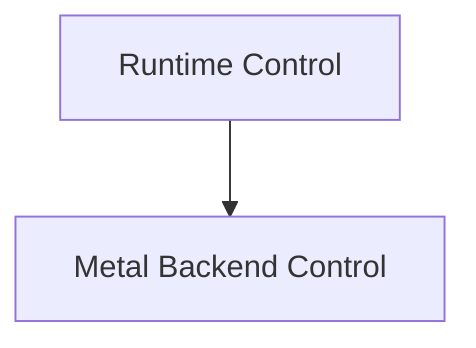

# Runtime Control Module

The `runtime_control` module provides essential functionalities for managing and interacting with the GGML Metal backend at runtime. It includes mechanisms for handling abort conditions and capturing compute operations for debugging or performance analysis.

## Architecture

The `runtime_control` module primarily interacts with the `ggml_backend_metal` module to expose low-level control over the Metal backend.

<!-- DIAGRAM_JSON
{
    "direction": "TD",
    "nodes": [
        {"id": "runtime_control", "label": "Runtime Control", "type": "module"},
        {"id": "metal_backend_control", "label": "Metal Backend Control", "type": "module", "link": "metal_backend_control.md"}
    ],
    "edges": [
        {"source": "runtime_control", "target": "metal_backend_control"}
    ],
    "groups": []
}
-->

## Sub-modules

### Metal Backend Control (`metal_backend_control.md`)
This sub-module encapsulates functions related to direct control of the Metal backend's runtime behavior. It allows for setting custom abort callbacks and capturing the next compute pass, which are crucial for debugging and specific operational requirements.

For more details, refer to the [Metal Backend Control documentation](metal_backend_control.md).