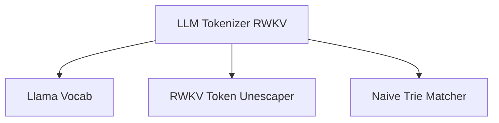

# rwkv_tokenizer Module Documentation

The `rwkv_tokenizer` module provides the implementation for the RWKV tokenization algorithm within the `llama.cpp` project. It is responsible for converting raw text into a sequence of tokens that can be processed by an RWKV language model.

## Architecture and Core Components

The `rwkv_tokenizer` module primarily leverages a `naive_trie` data structure to efficiently map RWKV-specific byte tokens to their corresponding integer IDs. It integrates with the `llama_vocab` module to retrieve vocabulary information and uses a utility function for unescaping RWKV tokens.

<!-- DIAGRAM_JSON
{
    "direction": "TD",
    "nodes": [
        {"id": "llm_tokenizer_rwkv", "label": "LLM Tokenizer RWKV", "type": "component", "link": null},
        {"id": "llama_vocab", "label": "Llama Vocab", "type": "external", "link": "llama_cpp_vocab.md"},
        {"id": "llama_unescape_rwkv_token", "label": "RWKV Token Unescaper", "type": "component", "link": null},
        {"id": "naive_trie", "label": "Naive Trie Matcher", "type": "component", "link": null}
    ],
    "edges": [
        {"source": "llm_tokenizer_rwkv", "target": "llama_vocab"},
        {"source": "llm_tokenizer_rwkv", "target": "llama_unescape_rwkv_token"},
        {"source": "llm_tokenizer_rwkv", "target": "naive_trie"}
    ],
    "groups": []
}
-->

### Component: `llm_tokenizer_rwkv`

The `llm_tokenizer_rwkv` class is the main entry point for RWKV tokenization. It inherits from `llm_tokenizer` and is responsible for initializing the tokenizer with a given vocabulary. During initialization, it constructs a `naive_trie` to store the RWKV tokens for efficient lookup.

-   **Purpose**: Provides the core logic for RWKV tokenization, converting text into token IDs.
-   **Dependencies**:
    -   `llama_vocab`: Used to access the vocabulary data, specifically token texts and their corresponding IDs.
    -   `llama_unescape_rwkv_token`: A utility function (likely defined elsewhere within the `llama_cpp` project) that decodes RWKV-specific escaped token representations into their raw byte sequences.
    -   `naive_trie`: An internal data structure used for fast prefix matching of tokens during the tokenization process.

### Internal Components:

-   **`naive_trie token_matcher`**: This member variable is an instance of `naive_trie`, a custom trie implementation used to store the vocabulary tokens. It enables efficient lookup of the longest possible token match from a given text segment, which is crucial for byte-pair encoding (BPE) and similar tokenization algorithms.

## How it Fits into the Overall System

The `rwkv_tokenizer` module is a specialized tokenizer within the larger [llama_cpp_vocab](llama_cpp_vocab.md) module, specifically residing under [tokenizer_algorithms](tokenizer_algorithms.md). It works in conjunction with the `llama_vocab` to provide the necessary tokenization capabilities for models that utilize the RWKV architecture. This module ensures that RWKV models can correctly process input text by converting it into the appropriate token format before inference. Its existence highlights the modular design of `llama.cpp`, allowing it to support various model architectures and their specific tokenization requirements.