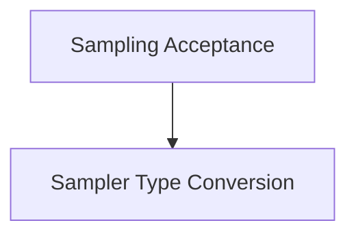

# Sampler Utilities Module Documentation

## Introduction

The `sampler_utilities` module provides essential functions for the common sampling process within the `llama.cpp` project. It includes core functionalities for sampling tokens and converting character representations into sampler types, supporting the flexible and efficient operation of the language model's generation capabilities.

## Architecture Overview

This module is a child of the `sampling_core_functions` module within the `llama_cpp_common` library. It interacts with the `llama_context` for its sampling operations.

The `sampler_utilities` module is composed of the following sub-modules:

*   [Sampling Acceptance](sampling_acceptance.md): Manages the sampling and acceptance of tokens.
*   [Sampler Type Conversion](sampler_type_conversion.md): Handles the conversion of character inputs to specific sampler types.

<!-- DIAGRAM_JSON
{
    "direction": "TD",
    "nodes": [
        {"id": "sampling_acceptance", "label": "Sampling Acceptance", "type": "module", "link": "sampling_acceptance.md"},
        {"id": "sampler_type_conversion", "label": "Sampler Type Conversion", "type": "module", "link": "sampler_type_conversion.md"}
    ],
    "edges": [
        {"source": "sampling_acceptance", "target": "sampler_type_conversion"}
    ],
    "groups": []
}
-->

## Sub-modules

### Sampling Acceptance
This sub-module, documented in [sampling_acceptance.md](sampling_acceptance.md), contains the logic for `common_sampler_sample_and_accept_n`. It is responsible for the intricate process of sampling tokens and determining their acceptance based on given criteria within the `llama_context`.

### Sampler Type Conversion
This sub-module, documented in [sampler_type_conversion.md](sampler_type_conversion.md), provides the utility function `common_sampler_types_from_chars`. It facilitates the dynamic configuration of the sampler by converting single character inputs into their corresponding `common_sampler_type` enumerations, enabling flexible control over the sampling strategy.
