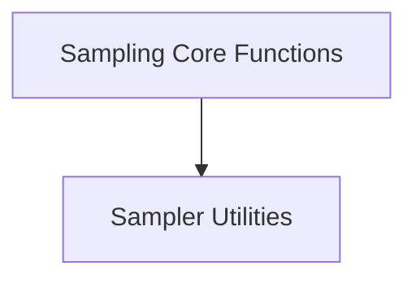

# sampling_core_functions Module Documentation

## Introduction and Purpose

The `sampling_core_functions` module is a fundamental component within the `llama_cpp_common.common_sampling` subsystem. It provides essential core functionalities related to the sampling process in the Llama.cpp project, including mechanisms for sampling and accepting tokens, and utilities for converting character representations to sampler types. This module is critical for controlling how tokens are selected and validated during text generation, ensuring adherence to various sampling strategies.

## Architecture Overview

The `sampling_core_functions` module is structured to encapsulate core sampling logic, making it reusable and maintainable. It currently contains one primary sub-module that handles specific utility functions for the sampling process.

<!-- DIAGRAM_JSON
{
    "direction": "TD",
    "nodes": [
        {"id": "sampling_core_functions", "label": "Sampling Core Functions", "type": "module"},
        {"id": "sampler_utilities", "label": "Sampler Utilities", "type": "module", "link": "sampler_utilities.md"}
    ],
    "edges": [
        {"source": "sampling_core_functions", "target": "sampler_utilities"}
    ],
    "groups": []
}
-->

## High-Level Functionality

### Sampler Utilities ([sampler_utilities.md](sampler_utilities.md))

This sub-module centralizes utility functions crucial for the sampling process. It includes functionalities such as `common_sampler_sample_and_accept_n`, which manages the sampling and acceptance of `n` tokens, and `common_sampler_types_from_chars`, which translates character inputs into specific common sampler types, enabling flexible configuration of sampling strategies.