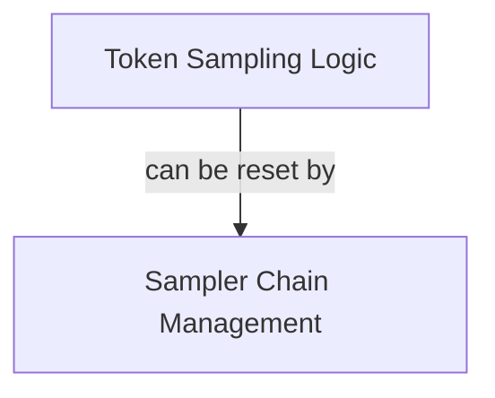

# Sampling Orchestration Module

## Introduction
The `sampling_orchestration` module is a critical component within the `llama_cpp_sampling` system, responsible for coordinating the token sampling process. It provides the core mechanisms to select the next token based on model logits and to manage the state of individual samplers or a chain of samplers.

## Architecture
The module is composed of two main sub-modules:
- **Token Sampling Logic**: Focuses on the immediate token selection from logits.
- **Sampler Chain Management**: Handles the coordination and resetting of multiple samplers when they are used in a sequence.

This module integrates closely with other parts of the `llama_cpp_sampling` system, providing the fundamental operations for generating output sequences.

<!-- DIAGRAM_JSON
{
    "direction": "TD",
    "nodes": [
        {"id": "token_sampling", "label": "Token Sampling Logic", "type": "module", "link": "token_sampling.md"},
        {"id": "sampler_chain_management", "label": "Sampler Chain Management", "type": "module", "link": "sampler_chain_management.md"}
    ],
    "edges": [
        {"source": "token_sampling", "target": "sampler_chain_management", "label": "can be reset by"}
    ],
    "groups": []
}
-->

## Sub-modules

### [Token Sampling Logic](token_sampling.md)
This sub-module encapsulates the functionality for selecting a single token from the probability distribution generated by the model. It takes the raw logits, applies various sampling techniques (managed by the sampler struct), and returns the chosen token.

### [Sampler Chain Management](sampler_chain_management.md)
This sub-module provides utilities for managing a collection or chain of samplers. Its primary role is to ensure that all samplers within a chain are reset to their initial state, preparing them for a new sampling operation or sequence generation. This is crucial for maintaining consistent and correct sampling behavior across multiple steps or generations.

