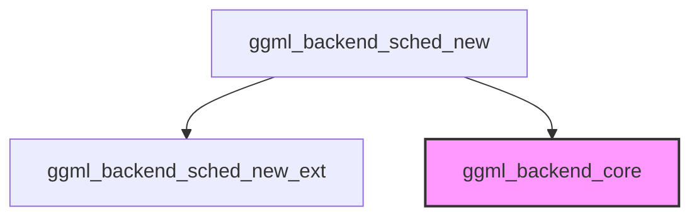

# Module: `scheduler_core`

## Introduction
The `scheduler_core` module is a fundamental component within the GGML backend scheduling system. Its primary responsibility is to facilitate the creation and configuration of the backend scheduler, which orchestrates the execution of computational graphs across various hardware backends. This module provides the entry point for initializing the backend scheduling mechanism, enabling parallel execution and operation offloading capabilities.

## Architecture and Component Relationships

The `scheduler_core` module resides within the `backend_scheduling` sub-module of `ggml_backend_core`. It primarily exposes a function to create a new backend scheduler instance. This function acts as a high-level interface, internally leveraging a more extended function for its implementation. It depends on core backend types defined in the broader `ggml_backend_core` module for managing different computation backends and their associated buffer types.

<!-- DIAGRAM_JSON
{
    "direction": "TD",
    "nodes": [
        {"id": "ggml_backend_sched_new", "label": "ggml_backend_sched_new", "type": "component", "link": null},
        {"id": "ggml_backend_sched_new_ext", "label": "ggml_backend_sched_new_ext", "type": "component", "link": null},
        {"id": "ggml_backend_core", "label": "ggml_backend_core", "type": "external", "link": "ggml_backend_core.md"}
    ],
    "edges": [
        {"source": "ggml_backend_sched_new", "target": "ggml_backend_sched_new_ext"},
        {"source": "ggml_backend_sched_new", "target": "ggml_backend_core"}
    ],
    "groups": []
}
-->



## Core Functionality

The main functionality of this module is encapsulated in the `ggml_backend_sched_new` function.

### `ggml_backend_sched_new`

```cpp
ggml_backend_sched_t ggml_backend_sched_new(
        ggml_backend_t * backends,
        ggml_backend_buffer_type_t * bufts,
        int n_backends,
        size_t graph_size,
        bool parallel,
        bool op_offload) {
            return ggml_backend_sched_new_ext(backends, bufts, n_backends, graph_size, parallel, op_offload, true);
        }
```

This function creates a new GGML backend scheduler. It serves as a convenience wrapper for `ggml_backend_sched_new_ext`, setting a default value for an internal parameter (specifically, `true` for an unspecified flag, likely related to default scheduler behavior or initialization).

**Parameters:**
*   `backends` (`ggml_backend_t *`): An array of backend instances that the scheduler will manage.
*   `bufts` (`ggml_backend_buffer_type_t *`): An array of buffer types corresponding to each backend.
*   `n_backends` (`int`): The number of backends provided.
*   `graph_size` (`size_t`): The estimated size of the computational graph to be scheduled. This helps in pre-allocating resources.
*   `parallel` (`bool`): A flag indicating whether operations should be scheduled for parallel execution across backends.
*   `op_offload` (`bool`): A flag indicating whether operations can be offloaded to different backends.

**Returns:**
*   `ggml_backend_sched_t`: A handle to the newly created backend scheduler instance.

## How it Fits into the Overall System

The `scheduler_core` module is a critical piece of the `ggml_backend_core` infrastructure, specifically within the `backend_scheduling` component. It provides the mechanism to initialize the `ggml_backend_sched_t` scheduler, which is responsible for intelligently distributing and executing computational tasks (graphs) across multiple available GGML backends (e.g., CPU, Metal, Vulkan). By abstracting the complexities of multi-backend orchestration, it enables efficient resource utilization and potentially faster execution of machine learning models. Its parameters allow for fine-grained control over parallel execution and offloading strategies, making it adaptable to various hardware configurations and performance requirements.