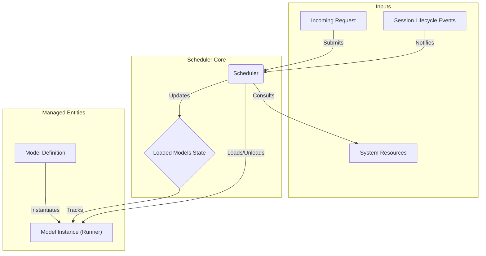

# scheduler_model_management
This module manages the lifecycle of AI models within a scheduler, handling requests for model loading, unloading, and reloading based on system resources and session activity.

<!-- DIAGRAM_JSON
{
    "nodes": [
        {
            "id": "A",
            "label": "Incoming Request"
        },
        {
            "id": "B",
            "label": "Scheduler"
        },
        {
            "id": "C",
            "label": "System Resources"
        },
        {
            "id": "D",
            "label": "Model Definition"
        },
        {
            "id": "E",
            "label": "Model Instance (Runner)"
        },
        {
            "id": "F",
            "label": "Loaded Models State"
        },
        {
            "id": "G",
            "label": "Session Lifecycle Events"
        }
    ],
    "edges": [
        {
            "source": "A",
            "target": "B",
            "label": "Submits"
        },
        {
            "source": "B",
            "target": "C",
            "label": "Consults"
        },
        {
            "source": "B",
            "target": "E",
            "label": "Loads/Unloads"
        },
        {
            "source": "D",
            "target": "E",
            "label": "Instantiates"
        },
        {
            "source": "B",
            "target": "F",
            "label": "Updates"
        },
        {
            "source": "F",
            "target": "E",
            "label": "Tracks"
        },
        {
            "source": "G",
            "target": "B",
            "label": "Notifies"
        }
    ],
    "groups": [
        {
            "id": "scheduler_core",
            "label": "Scheduler Core",
            "nodes": [
                "B",
                "F"
            ]
        },
        {
            "id": "inputs",
            "label": "Inputs",
            "nodes": [
                "A",
                "C",
                "G"
            ]
        },
        {
            "id": "managed_entities",
            "label": "Managed Entities",
            "nodes": [
                "D",
                "E"
            ]
        }
    ]
}
-->
