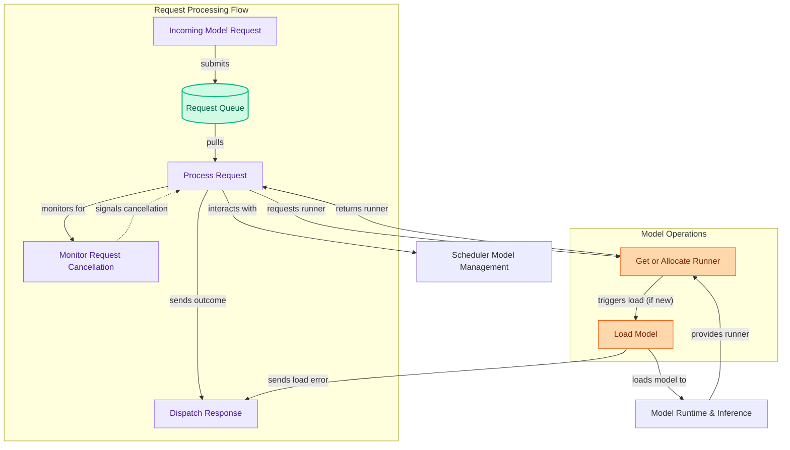

# Scheduler Request Processing
This module handles the core logic for processing incoming model requests, including queuing, allocating model runners, managing model loading and unloading, and gracefully managing request lifecycles and cancellation.
<!-- DIAGRAM_JSON
{
    "direction": "TD",
    "nodes": [
        {
            "id": "incoming_request",
            "label": "Incoming Model Request",
            "type": "component",
            "link": null
        },
        {
            "id": "request_queue",
            "label": "Request Queue",
            "type": "data",
            "link": null
        },
        {
            "id": "process_request",
            "label": "Process Request",
            "type": "component",
            "link": null
        },
        {
            "id": "load_model",
            "label": "Load Model",
            "type": "component",
            "link": null
        },
        {
            "id": "get_runner",
            "label": "Get or Allocate Runner",
            "type": "component",
            "link": null
        },
        {
            "id": "handle_cancellation",
            "label": "Monitor Request Cancellation",
            "type": "component",
            "link": null
        },
        {
            "id": "dispatch_response",
            "label": "Dispatch Response",
            "type": "component",
            "link": null
        },
        {
            "id": "model_management",
            "label": "Scheduler Model Management",
            "type": "external",
            "link": "scheduler_model_management.md"
        },
        {
            "id": "model_runtime",
            "label": "Model Runtime & Inference",
            "type": "external",
            "link": "model_runtime_and_inference.md"
        }
    ],
    "edges": [
        {
            "source": "incoming_request",
            "target": "request_queue",
            "label": "submits"
        },
        {
            "source": "request_queue",
            "target": "process_request",
            "label": "pulls"
        },
        {
            "source": "process_request",
            "target": "get_runner",
            "label": "requests runner"
        },
        {
            "source": "get_runner",
            "target": "load_model",
            "label": "triggers load (if new)"
        },
        {
            "source": "load_model",
            "target": "model_runtime",
            "label": "loads model to"
        },
        {
            "source": "model_runtime",
            "target": "get_runner",
            "label": "provides runner"
        },
        {
            "source": "get_runner",
            "target": "process_request",
            "label": "returns runner"
        },
        {
            "source": "process_request",
            "target": "dispatch_response",
            "label": "sends outcome"
        },
        {
            "source": "process_request",
            "target": "handle_cancellation",
            "label": "monitors for"
        },
        {
            "source": "handle_cancellation",
            "target": "process_request",
            "label": "signals cancellation"
        },
        {
            "source": "process_request",
            "target": "model_management",
            "label": "interacts with"
        },
        {
            "source": "load_model",
            "target": "dispatch_response",
            "label": "sends load error"
        }
    ],
    "groups": [
        {
            "id": "request_flow",
            "label": "Request Processing Flow",
            "role": "analytical",
            "nodes": [
                "incoming_request",
                "request_queue",
                "process_request",
                "dispatch_response",
                "handle_cancellation"
            ]
        },
        {
            "id": "model_ops",
            "label": "Model Operations",
            "role": "generative",
            "nodes": [
                "load_model",
                "get_runner"
            ]
        }
    ]
}
-->
