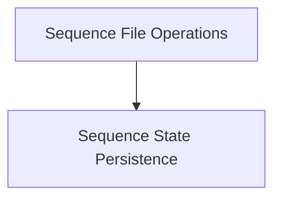

# Sequence File Operations

## Introduction

The `sequence_file_operations` module is responsible for managing the persistence of sequence states within the `llama_cpp_context` module. It provides core functionality for saving and loading the state of individual sequences to and from files, enabling the restoration of conversational or processing states.

## Architecture Overview

The `sequence_file_operations` module primarily interacts with its sub-module, `sequence_state_persistence`, to perform file-based operations on sequence states.

<!-- DIAGRAM_JSON
{
    "direction": "TD",
    "nodes": [
        {"id": "sequence_file_operations", "label": "Sequence File Operations", "type": "module", "link": "sequence_file_operations.md"},
        {"id": "sequence_state_persistence", "label": "Sequence State Persistence", "type": "module", "link": "sequence_state_persistence.md"}
    ],
    "edges": [
        {"source": "sequence_file_operations", "target": "sequence_state_persistence"}
    ],
    "groups": []
}
-->

## Sub-modules

### [Sequence State Persistence](sequence_state_persistence.md)
This sub-module encapsulates the logic for saving and loading the complete state of a sequence to and from a specified file path. It ensures that sequence data, including tokens and other relevant context, can be efficiently stored and retrieved, facilitating checkpointing and state restoration.